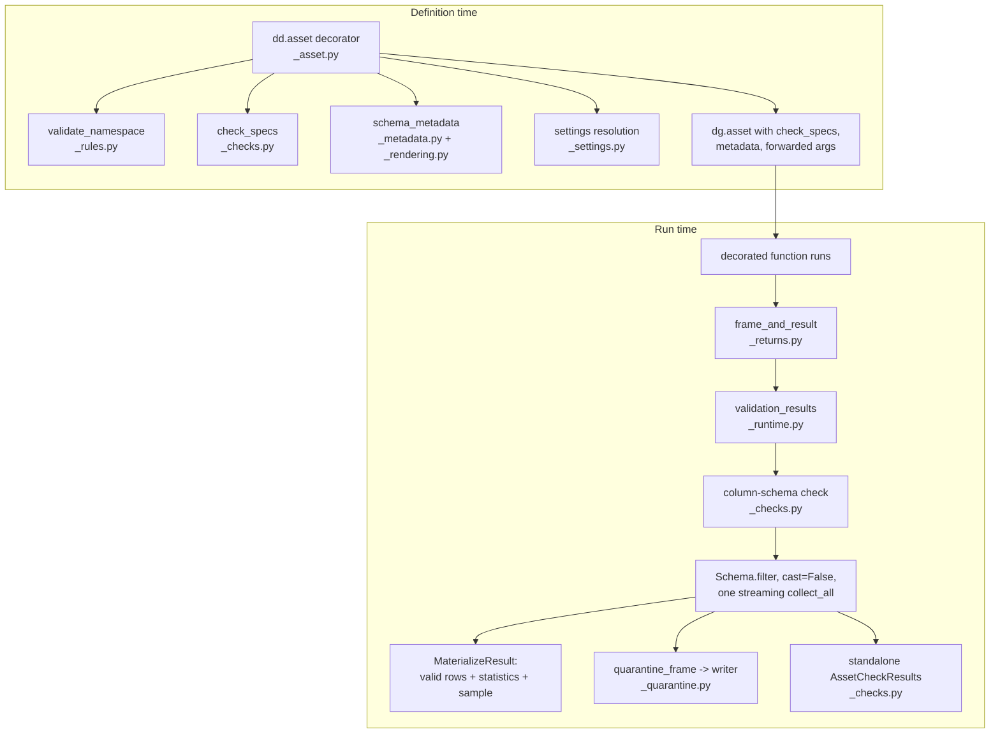
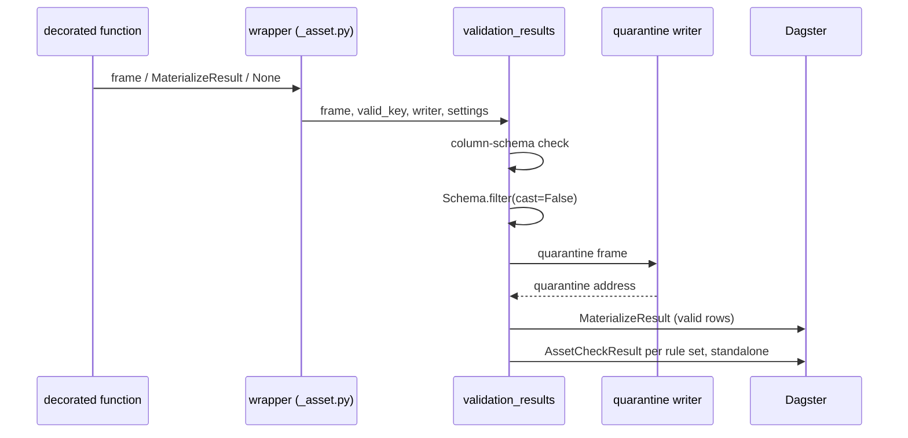

# dagster-dataframely Architecture

How the package turns one schema declaration into a validated Dagster asset.
Written for maintainers and for agents working in the repo.
Code references name files and symbols, never line numbers.
Current as of version 0.8.0.

## Overview

`dagster-dataframely` attaches a Dataframely schema to a Dagster asset through one decorator, `dd.asset`.
From that single declaration the package fills the catalog's Columns tab before the first run, reports every schema rule as an asset check with its own history, and decides what a failing row costs.

The philosophy is schema-on-write with no lenient mode.
The package never casts: a frame whose columns or dtypes mismatch the schema stops the run before any row is filtered.
The only dial is `quarantine`.
Declaring one is the consent to partial data; leaving it undeclared is the refusal, and then any failing row aborts the run.

The package ships no IO manager.
Valid rows go wherever the asset's own IO manager puts them.
Invalid rows go to the quarantine, which is a file or a table, never an asset (ADR-0004).

## Architecture Diagram

## The two paths

Every feature hangs off one of two moments: when the asset is declared, and when it runs.
ADR-0002 fixes the boundary: the decorator resolves everything it can at definition time, and the runtime entry takes asset keys as arguments rather than reading the execution context (ADR-0001).
That boundary is what makes a schema-backed asset callable in a unit test with no run.

### Definition time: the decorator

**Location**: `src/dagster_dataframely/_asset.py`, function `asset`.

The decorator does five things before `dg.asset` ever sees the function:

1. Validates the schema's names against the reserved namespace (`validate_namespace` in `_rules.py`, ADR-0008).
   Every public function that takes a schema runs this guard itself; nothing caches it.
2. Derives one check spec per rule set from the schema alone (`check_specs` in `_checks.py`).
   No run is needed, so the check list exists in the catalog before the first materialization.
3. Builds `dagster/column_schema` metadata from the schema (`schema_metadata` in `_metadata.py`, rendered by `_rendering.py`), so the Columns tab shows dtypes, descriptions, nullability, uniqueness, the primary key, and the remaining rules as column constraints, all before the first run.
4. Resolves every setting once, through the setting's sources (`_settings.py`).
5. Resolves the valid asset key, and with `quarantine=True` forces a `context` parameter and claims `<name>_quarantine`.

It then calls `dg.asset` with the check specs, the metadata, and roughly 25 forwarded `dg.asset` parameters, each spelled out with a runtime-real type.
It wraps `dg.asset` rather than stacking on it because check specs are op outputs, so no stacked form is possible (ADR-0005).
The decorator imports `is_context_provided` from Dagster internals; `tests/test_upstream_characterization.py` pins that private API.

### Run time: validation_results

**Location**: `src/dagster_dataframely/_runtime.py`, function `validation_results`.

The wrapper calls the decorated function, unpacks its return through `frame_and_result` (`_returns.py`), builds a quarantine writer if one is declared, and hands everything to `validation_results`.
Two calls decide everything:

1. The column-schema check, off `collect_schema()`.
   A mismatch reports through a blocking check and raises `ColumnSchemaError`; no row is filtered and neither table is written.
2. `Schema.filter(cast=False)`, in one `collect_all` on the streaming engine.
   It is the only validation call.
   A `DataFrame` costs a free `.lazy()`; a `LazyFrame` executes once, in that call.

`validation_results` writes the quarantine and never learns where it went: the writer takes the invalid rows and hands back a quarantine address, nothing else (ADR-0001, ADR-0006).

### The six outcomes

The asset's declaration decides which outcome a run reaches, never an argument's value.

| Outcome | Trigger | What happens |
| --- | --- | --- |
| Skip | Decorated function returns `None` | Nothing materializes, the partition stays unmaterialized, the run succeeds. Rules still report over `Schema.create_empty()`, because a check spec is a non-optional op output. |
| Column-schema mismatch | Columns or dtypes differ from the schema | Blocking check fails, `ColumnSchemaError` raises, no row is filtered. |
| Clean | No rows failed | Valid table materializes. The writer is never called, so a clean run leaves no empty quarantine. |
| Abort | Rows failed, no quarantine declared | Every rule reports at ERROR, then `ValidationAbortError`. Both row sets are discarded; the last-known-good table survives. |
| Nothing survived | Rows failed, quarantine declared, no rows passed | Invalid rows are written first, checks carry the quarantine address, then `NothingSurvivedError`. The empty table never replaces a last-known-good snapshot. |
| Quarantined | Rows failed, quarantine declared, some rows passed | Valid table materializes with invalid-row metadata; invalid rows are readable at the address; every rule reports at WARN. |

Severity derives once, from whether the valid table was written: WARN with a quarantine to go to, ERROR with nowhere to go or nothing left.
No code path can hand two sibling checks different severities.

Check results are yielded standalone, never bundled onto a materialization, because direct invocation satisfies a check output only from a standalone `AssetCheckResult` (ADR-0002).

## Components

### Rules and checks

**Location**: `src/dagster_dataframely/_rules.py`, `_checks.py`, `_naming.py`.

`described_rules` parses Dataframely's `column|rule` naming once into `DescribedRule` records: check name, column, rule name, docstring, expression.
`_checks.py` builds both sides from the same grouping, `_rule_sets`: `check_specs` derives the declared checks, `check_results` and `rule_results` report against them.
Sharing the grouping stops the two sides disagreeing; `docs/out-of-scope/rule-sets-fixed-at-definition-time.md` records why the agreement is held by a test rather than a shared value object.

`check_granularity` sets how far the rules collapse into checks: one check per rule at `rule`, per column at `column`, one check at `schema`.
`schema_rules` decides where the schema-level rules land at `column` granularity.
The column-schema check is not a rule: it reports on its own at every granularity and never joins a rule set.

`_naming.py` holds the name derivation and the reserved strings: `RESERVED_NAMESPACE = "dy_"`, `COLUMN_SCHEMA_CHECK = "dy_schema__columns"`, `SCHEMA_RULES_CHECK = "dy_schema__rules"`.

### Quarantine

**Location**: `src/dagster_dataframely/_quarantine.py`; frame construction in `_runtime.py`, function `quarantine_frame`.

The quarantine is where invalid rows are written, addressed by the asset key `<name>_quarantine`.
It is not an asset: it is evidence of a run, and it holds no place in the graph unless `quarantine_spec` gives it one (ADR-0004, which superseded the multi-asset design in ADR-0003).

The quarantine frame is `FailureInfo.details()`: the invalid rows plus a rule column per rule, reading `valid` / `invalid` / `unknown`.
Rule columns are renamed into the `dy_` namespace, so a column of the quarantine and the asset check for the same rule share one string.
They are also cast from `Enum` to `String`, the one cast the package makes, because a raw `Enum` panics the Delta writer.

Two writers, and the caller names the one it means:

- `delegating_writer` delegates to the IO manager the asset is already bound to.
  Adjacency by delegation, not configuration (ADR-0006).
- `file_writer` writes a parquet file under `quarantine_dir`.
  It exists for direct invocation, the one case with no step.

`<name>_quarantine` sits in Dagster's own key space, which the user shares, so the reservation is proved at run time by `validate_quarantine_key`, not at load (ADR-0007; a load-time check missed the collision that caused the silent data loss in #114).

### Return handling

**Location**: `src/dagster_dataframely/_returns.py`.

`frame_and_result` accepts what the decorated function returned: a `DataFrame`, a `LazyFrame`, a `dg.MaterializeResult` carrying one, or `None` to skip.
`with_returned_fields` merges a returned `metadata`, `tags` and `data_version` onto the materialization the runtime builds.
`_require_frame` in `_runtime.py` guards the dynamic call path; `check_results` has no such guard on purpose (`docs/out-of-scope/wiring-argument-type-guards.md`).

### Settings

**Location**: `src/dagster_dataframely/_settings.py`.

Each setting resolves through three sources, each overriding the one before: the package default, then a `DAGSTER_DATAFRAMELY_*` environment variable, then the `dd.asset` argument.
An empty environment value is refused rather than read as unset, so a deployment's unexpanded `${SCRATCH}` fails naming the variable.

| Setting | Env variable | Default |
| --- | --- | --- |
| `check_granularity` | `DAGSTER_DATAFRAMELY_CHECK_GRANULARITY` | `rule` |
| `schema_rules` | `DAGSTER_DATAFRAMELY_SCHEMA_RULES` | `collapsed` |
| `statistics` | `DAGSTER_DATAFRAMELY_STATISTICS` | `True` |
| `max_failure_samples` | `DAGSTER_DATAFRAMELY_MAX_FAILURE_SAMPLES` | `5` |
| `row_sample` | `DAGSTER_DATAFRAMELY_ROW_SAMPLE` | `5` |
| `quarantine_dir` | `DAGSTER_DATAFRAMELY_QUARANTINE_DIR` | `None` |

`quarantine_dir` has only the first two sources; it takes no argument.
`quarantine` itself is not a setting: no environment variable reaches it, because consent to partial data belongs in code review.

The runtime resolves the sampling and statistics settings before the column-schema check, so a mistyped environment variable fails the same way on every outcome.
`check_granularity` and `schema_rules` must reach `validation_results` as the values the check specs were derived with; the decorator resolves each once and hands it to both sides.

### Metadata and observability

**Location**: `src/dagster_dataframely/_metadata.py`, `_rendering.py`, `_statistics.py`, `_samples.py`.

At definition time, `table_schema` and `schema_metadata` build the `dagster/column_schema` value, with `_rendering.py` producing the human-readable column constraints and check descriptions.

At run time the materialization carries:

- `dagster/row_count` for the valid rows, under Dagster's own key.
- `dataframely/valid_statistics/<group>`: skimr-style tables per dtype group (`numeric`, `temporal`, `string`, `boolean`), from `_statistics.py`.
- A bounded sample of real rows, from `_samples.py`, sized by `row_sample`.
  A sample is absent, never empty.
- On the quarantined outcome: `dataframely/quarantine_address`, `dataframely/invalid_count`, `dataframely/invalid_by_rules` (a co-occurrence table, biggest rule set first), and `dataframely/invalid_sample` with rule columns included.

The outcomes that raise have no materialization to carry the address, so `dataframely/quarantine_address` rides the check results instead (`_addressed` in `_runtime.py`).

### Hand-wiring

**Location**: `src/dagster_dataframely/wiring.py`.

A namespace-only re-export module of thirteen names for building a plain `@dg.asset` out of the same parts the decorator uses: `check_specs`, `check_results`, `validation_results`, `quarantine_frame`, `schema_metadata`, `table_schema`, `check_name`, `QuarantineWriter`, `delegating_writer`, `file_writer`, `quarantine_path`, `validate_quarantine_key`, `AssetYield`.
Hand-wiring never shapes the decorator: the design priority is end user first, maintainer legibility second, hand-wirer convenience never a goal.

### Errors

**Location**: `src/dagster_dataframely/errors.py`.

All package errors derive from `DagsterDataframelyError`.
Naming and namespace guards: `ReservedColumnError`, `UnnameableColumnError`, `CheckNameCollisionError`, `QuarantineKeyCollisionError`.
Configuration: `InvalidSettingError`, `QuarantineDirError`.
Input: `CollectionNotSupportedError`, `MaterializeResultValueError`, `MaterializeResultFieldError`.
Validation outcomes: `ColumnSchemaError`, `ValidationAbortError`, `NothingSurvivedError`.
A wrong return type raises Dagster's own `DagsterInvariantViolationError`, because that is a wiring mistake, not a data one.

## Reserved namespaces

Three, and the third is unlike the other two:

- `dy_`: every check name, rule column and check-result metadata key the package generates into Dagster.
  Never anything a user types.
- `dataframely/`: every materialization metadata key the package names itself, paralleling `dagster/`.
  The valid row count is the exception; Dagster already owns `dagster/row_count`.
- `<name>_quarantine`: the asset key a quarantine is addressed by.
  It sits in user key space, so it is the one reservation somebody else can take first, and the one checked at run time.

## Configuration summary

Enable validation by decorating with `dd.asset(Schema)`.
Enable a quarantine with `quarantine=True`, which forces the decorated function to declare `context`.
Everything else resolves through the settings table above.
`pyproject.toml` declares the floor versions: `dagster>=1.13.20`, `dataframely>=3.0.0`, `polars>=1.44.1`.

## Code References

| Component | File | Key symbols |
| --- | --- | --- |
| Public API | `src/dagster_dataframely/__init__.py` | `asset`, `quarantine_spec`, `Granularity`, `SchemaRules`, `errors`, `wiring` |
| Decorator | `src/dagster_dataframely/_asset.py` | `asset`, `DecoratedFn` |
| Runtime | `src/dagster_dataframely/_runtime.py` | `validation_results`, `quarantine_frame`, `AssetYield` |
| Checks | `src/dagster_dataframely/_checks.py` | `check_specs`, `check_results`, `rule_results`, `column_schema_result`, `filtered`, `_rule_sets` |
| Rules | `src/dagster_dataframely/_rules.py` | `DescribedRule`, `described_rules`, `validate_namespace` |
| Quarantine | `src/dagster_dataframely/_quarantine.py` | `quarantine_spec`, `delegating_writer`, `file_writer`, `quarantine_path`, `validate_quarantine_key` |
| Returns | `src/dagster_dataframely/_returns.py` | `frame_and_result`, `with_returned_fields` |
| Settings | `src/dagster_dataframely/_settings.py` | `_Setting`, `CHECK_GRANULARITY`, `QUARANTINE_DIR` |
| Metadata | `src/dagster_dataframely/_metadata.py` | `table_schema`, `schema_metadata`, `quarantine_metadata` |
| Rendering | `src/dagster_dataframely/_rendering.py` | `column_constraints`, `check_description` |
| Statistics | `src/dagster_dataframely/_statistics.py` | `statistics_metadata` |
| Samples | `src/dagster_dataframely/_samples.py` | `sample_rows`, `sample_metadata` |
| Naming | `src/dagster_dataframely/_naming.py` | `check_name`, `RESERVED_NAMESPACE` |
| Errors | `src/dagster_dataframely/errors.py` | `DagsterDataframelyError` and subclasses |
| Hand-wiring | `src/dagster_dataframely/wiring.py` | thirteen re-exports |

Decisions live in `docs/adr/` (0001 through 0008), declined designs in `docs/out-of-scope/`, measurements in `docs/research/`.
`CONTEXT.md` is the glossary and decides every word; the glossary below is a pointer, not a replacement.

## Glossary

Sourced from `CONTEXT.md`, which holds the full definitions and the banned alternatives.

| Term | Definition |
| --- | --- |
| Schema-backed asset | An asset `dd.asset` built, or one hand-wired out of the same parts. |
| Decorated function | The function `dd.asset` wraps; returns a frame, a `MaterializeResult` carrying one, or `None` to skip. |
| Outcome | How a run ended. Six exist; the declaration decides which one a run reaches. |
| Skip | What a decorated function asks for by returning `None`. |
| Quarantine | Where invalid rows are written, addressed by `<name>_quarantine`. Not an asset. |
| Writer | What puts the invalid rows somewhere and hands back a quarantine address. |
| Quarantine address | Where a writer put the invalid rows, rendered for a reader. An asset key or a file path. |
| Rule column | A quarantine column carrying one rule's result per row: `valid`, `invalid` or `unknown`. |
| Rule set | The rules one asset check reports for. |
| Granularity | How far the rules collapse into checks: `rule`, `column` or `schema`. |
| Column schema | A frame's columns and their dtypes; a mismatch stops the run before any row is filtered. |
| Setting | One configurable value resolved through three sources: default, environment variable, argument. |
| Direct invocation | Calling a decorated asset instead of running it; the reason `file_writer` exists. |
| Hand-wiring | Building a `@dg.asset` out of `dd.wiring` instead of using `dd.asset`. |
| Reserved namespace | `dy_`, `dataframely/`, and `<name>_quarantine`. |
