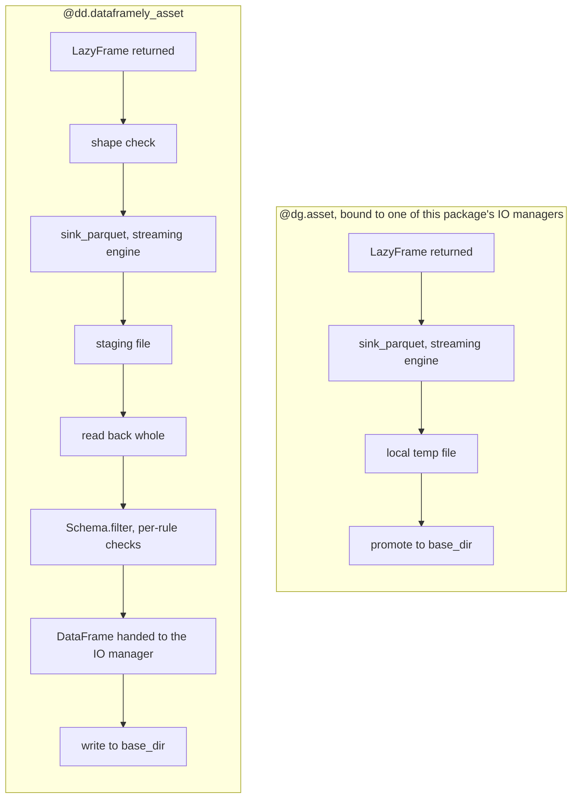

# `dagster-dataframely`

[Dataframely](https://github.com/Quantco/dataframely) describes what a [Polars](https://pola.rs) frame should look like.
[Dagster](https://dagster.io) has first-class places to show that: the Columns tab and asset checks.
The goal of `dagster-dataframely` is to wire the two together, so you describe a table once and Dagster shows it everywhere.

```python
import dagster as dg
import dataframely as dy
import polars as pl

import dagster_dataframely as dd


class Orders(dy.Schema):
    order_id = dy.String(primary_key=True)
    amount = dy.Float64(nullable=False, min=0.0)


@dd.dataframely_asset(schema=Orders)
def orders(raw_orders: pl.DataFrame) -> pl.DataFrame:
    return raw_orders.select("order_id", "amount")
```

That's the whole integration.
From that one declaration you get:

- **The catalog's Columns tab**, filled in before the asset has ever run: dtypes, descriptions, nullability, uniqueness, the primary key stated once at table level, and every remaining constraint listed beside it.
- **One asset check per Dataframely rule**, each with its own pass/fail history.
- **A blocking shape check** that compares the frame's columns and dtypes against the schema, before a single row is filtered.
- **Somewhere for the rows that don't fit**, if you want it.
  Add `quarantine=dg.AssetOut()` and the rows the schema rejects are written to a sibling asset instead of failing the run, as long as something survives.

The decorated function is an ordinary Dagster asset body.
Upstream assets bind as parameters, you declare `context` if you want it, and you can return any of four things: a frame, or a `dg.MaterializeResult` carrying one, eager or lazy.

```text
pl.DataFrame                dg.MaterializeResult[pl.DataFrame]
pl.LazyFrame                dg.MaterializeResult[pl.LazyFrame]
```

If you have metadata, tags or a data version to attach, return the result rather than the bare frame.
That's the route this package prefers, and [Attaching your own metadata](#attaching-your-own-metadata) explains why.

`@dg.multi_asset` is the mechanism underneath, but the vocabulary is `@dg.asset`'s.
Anything `@dg.asset` lets you say about one asset, you can say here under the same name, and a test asserts that in both directions.

## Quick start

```bash
uv add dagster-dataframely
```

You'll need Python 3.12 or newer.

`dagster`, `dataframely` and `polars` are the dependencies.
The IO managers import `pydantic` and `universal-pathlib` directly, so both are declared too; both already arrive with `dagster`, so nothing new lands in your environment.
To write to `s3://`, `gs://` or `az://`, install that scheme's fsspec filesystem alongside: `s3fs`, `gcsfs` or `adlfs`.

> [!NOTE]
> **Pre-1.0.**
> The public surface is covered by a characterization test rather than held by convention, so it won't move quietly.
> It can still move: a `0.x` minor release is where a breaking change lands.
> Pin `dagster-dataframely>=0.5,<0.6` if that matters to you.

Declare the schema and the asset as above, then tell the code location where to write:

```python
defs = dg.Definitions(
    assets=[orders],
    resources={"io_manager": dd.DataframelyParquetIOManager(base_dir="data/warehouse")},
)
```

Point `dg dev` at that module and materialize `orders` from the UI, or call `dg.materialize([orders], resources=...)` from a script.

Four things now exist that didn't before:

- The catalog's Columns tab, filled from `Orders`, before the first run.
  See [Declaring an asset](#declaring-an-asset).
- One asset check per rule, each with its own history, evaluated on every run.
  See [Materializing an asset](#materializing-an-asset).
- A materialization carrying the row count, a row sample and per-dtype statistics.
  See [Materializing an asset](#materializing-an-asset).
- A parquet file under `base_dir`, named for the asset key.
  See [Storage](#storage).

The rest of this README walks through those, in the order you'll meet them.

## Declaring an asset

`schema=` is the only argument you have to pass.
Everything else either forwards to Dagster under the name Dagster already uses, or resolves through [Settings](#settings).

The decorated function is the part you write, so it's where parity with `@dg.asset` matters most:

```python
@dd.dataframely_asset(schema=Orders, quarantine=dg.AssetOut(), group_name="sales")
def orders(context: dg.AssetExecutionContext, raw_orders: pl.DataFrame) -> pl.DataFrame:
    context.log.info("%d rows arrived", raw_orders.height)
    return raw_orders.select("order_id", "amount")
```

Upstream assets bind by parameter name, just as they do on a plain `@dg.asset`, and `ins=` and `deps=` cover the cases a name can't express.
Declare `context` when you want to reach the run itself: the partition key, the log, resources and configuration all hang off it.
Nothing rewrites your signature, so what you decorate stays a function you can read.

**What you return decides what happens, not how you annotated it.**
A `LazyFrame` is staged and validated whichever way the signature spells it, and a `dg.MaterializeResult` is unwrapped the same way.
`@dg.asset` does hold you to its annotation, by inferring the output's `dagster_type` from it.
This decorator can't, because validation is eager, so the asset always stores a `DataFrame` however the decorated function arrived at one.
Annotate it anyway and a type checker will hold you to it instead.
Parameterize a returned result when you do, since a bare `dg.MaterializeResult` is an implicit `Any` that a strict checker rejects.

Return a result rather than a bare frame as soon as you have something to say about the materialization.
It's the route this package prefers over the context, and the only one that survives a direct call.

Two things exist as soon as the module imports, before you run anything:

- **The Columns tab**, built from the schema.
  Dtypes, descriptions, nullability, uniqueness, the primary key at table level, and every remaining constraint beside its column.
- **A check spec per rule**, so the catalog lists the checks an asset will report and a red one has a name before it ever goes red.

The asset's description comes from the schema's docstring, which [Naming](#naming) covers, and the live schema class rides along in the definition's metadata so the CSV reader can find its dtypes.

**`schema=` takes a single `dy.Schema`, never a `dy.Collection`.**
Passing a Collection raises `CollectionNotSupportedError` at decoration time.
Declare one asset per member instead, each with the member's own schema.
The parts under [Hand-wiring](#hand-wiring-and-how-the-package-works-under-the-hood) are no route to one either, because `process` is single-schema by signature: assembling a Collection means reimplementing the hardest part of this package rather than composing it.

## The failure policy is the asset's declared shape

There's no lenient mode and no strict flag, and that's deliberate.
Declaring a quarantine **is** your consent to partial data, so what an invalid row costs is visible in the definition and can't disagree with what the asset declares.

| what was returned | valid table | quarantine | checks | run |
| --- | --- | --- | --- | --- |
| columns or dtypes that are not the schema's | not written | not written | the shape check fails, blocking | fails, `SchemaShapeError` |
| every row valid | written | skipped, not written empty | all pass | green |
| some rows rejected, no quarantine declared | not written | n/a | fail at `ERROR` | fails, `ValidationAbortError` |
| some rows rejected, quarantine declared | the survivors | the invalid rows | fail at `WARN` | green |
| every row rejected, quarantine declared | skipped | every row | fail at `ERROR` | fails, `NothingSurvivedError` |

Every error this package raises lives in `dd.errors` and subclasses `dd.errors.DagsterDataframelyError`, so you can catch one by name or catch the whole family.

**Without a quarantine, every row has to be valid.**
A run that rejects even one row fails and writes nothing, so your last-known-good table stays in place.
Landing the survivors and dropping the rest is the failure this package exists to make visible, so you can't get there by configuration.
If you want to drop rows, drop them yourself, in your own asset body, where the drop is a line you wrote:

```python
@dd.dataframely_asset(schema=Orders)
def orders(raw_orders: pl.DataFrame) -> pl.DataFrame:
    valid, _ = Orders.filter(raw_orders)
    return valid
```

The quarantine table carries the invalid rows with their original columns, then one `String` column per rule reading `valid`, `invalid` or `unknown`, named exactly as that rule's asset check.
Its materialization also carries a `cooccurrence` table, so one broken upstream field that trips three rules reads as one row rather than three unrelated counts.
It inherits the asset's own key prefix, group and IO manager, and its own `dg.AssetOut` can override any of them, which is how you send invalid rows to a separate storage and ownership domain.
Three settings raise `QuarantineSettingError` instead of being honoured: `automation_condition`, `freshness_policy` and `code_version` can't differ between two outs of one step, so they belong on the decorator, where they cover both.

Its only parent in the graph is the valid table, so the lineage runs `raw_orders`, then `orders`, then `orders_quarantine`, rather than fanning both tables off `raw_orders`.
That edge is asset-grained rather than row-grained: no row in the quarantine came from the valid table, since `Schema.filter` splits one frame into two.
What it states is that the quarantine can't be planned or materialized without the valid table, which is true, both being outs of one step.
It costs you one thing: a clean run skips the quarantine, so Dagster reads it as stale against the valid table's newer materialization until the next run that rejects a row.

## The package never casts

The shape check compares your frame's dtypes against the schema's and aborts on a mismatch, and the filter runs with `cast=False`.
A `Duration('ns')` arriving where the schema declares `Duration('us')` is a pipeline defect, and silently widening it is how a thousandfold error reaches a table nobody re-reads.

If you do want conformance, write the cast yourself, in your own asset body, where you can see it:

```python
@dd.dataframely_asset(schema=Orders)
def orders(raw_orders: pl.DataFrame) -> pl.DataFrame:
    return Orders.cast(raw_orders)
```

The one cast the package makes is on columns it generated itself: the quarantine's rule columns go from `Enum` to `String`, because a raw `Enum` panics the Delta writer.

## Materializing an asset

Launching is Dagster's business and works the way it always does: materialize from the UI, from a schedule or a sensor, or call `dg.materialize([orders], resources={...})`.
What the run leaves behind is the part this package is for, and it lands on three surfaces.

**The valid table's materialization.** `dagster/row_count` is how many rows survived validation, not how many arrived.
`sample` holds the first few of those rows, and `stats/numeric`, `stats/temporal`, `stats/string` and `stats/boolean` summarize the columns of each dtype family present.
The IO manager you bound adds `path`, `bytes_written` and `dagster/storage_kind` for the file it wrote; see [Storage](#storage).

**The checks.**
The shape check reports first and blocks, then one check per rule, or fewer once `check_granularity` collapses them.
A failing rule carries its own counts and up to `max_failure_samples` of the rows it rejected.
Severity follows the run's outcome rather than the rule: an invalid row with a quarantine to go to is a `WARN`, and the same row with nowhere to go is an `ERROR`.

**The quarantine's materialization**, on the runs that write one.
Its `dagster/row_count` is how many rows were rejected, `cooccurrence` tabulates which rules the rows broke together, biggest group first, and the same statistics tables describe what the invalid rows hold.
It carries no row sample, for the reason [Settings](#statistics-and-both-samples-are-on-by-default) gives.

The Columns tab isn't a run surface.
It comes off the definition, so it's filled in before the first run and stays filled after a failed one.

## Testing an asset

To test an asset, call it.
Direct invocation is Dagster's documented unit-testing path, and here it costs you nothing: no run, no IO manager, no instance.
A call hands back the same materializations and check results a run yields, as ordinary Python objects, and the validated frame comes off `value`:

```python
@dd.dataframely_asset(schema=Orders, quarantine=dg.AssetOut())
def orders(raw_orders: pl.DataFrame) -> pl.DataFrame:
    return raw_orders.select("order_id", "amount")


def test_orders_quarantines_the_negative_amount():
    raw_orders = pl.DataFrame({"order_id": ["a", "b", "c"], "amount": [1.0, 2.0, -3.0]})

    events = list(orders(raw_orders))
    tables = {
        event.asset_key: event.value
        for event in events
        if isinstance(event, dg.MaterializeResult)
    }
    checks = {
        event.check_name: event.passed
        for event in events
        if isinstance(event, dg.AssetCheckResult)
    }

    assert tables[dg.AssetKey(["orders"])].height == 2
    assert tables[dg.AssetKey(["orders_quarantine"])].height == 1
    assert not checks["dy_rule__amount__min"]
```

Every check the asset declares comes back, standalone and fully addressed, so a call and a run report the same names against the same keys.
The keys are resolved where you declared the asset rather than looked up from a running step, which is what makes the quarantine's key knowable outside a run, however it was decided.

If the decorated function declares a `context`, build one with `dg.build_asset_context()`.
The partitioned `orders` from [Partitioning](#partitioning) takes one and nothing else, so its whole call is a context carrying the key:

```python
events = list(orders(dg.build_asset_context(partition_key="2026-01-02")))
```

The context comes first and the frames follow, exactly as Dagster orders them.
An asset that aborts raises out of the call, so `pytest.raises(dd.errors.ValidationAbortError)` is how you test the policy itself.

**A decorated function that attaches metadata through the context is the one thing you can't test this way.** `context.add_asset_metadata` raises under a direct call:

```text
AttributeError: 'DirectAssetExecutionContext' object has no attribute '_step_execution_context'
```

A plain `@dg.asset` raises the same thing, so this is Dagster's gap rather than something this package introduces.
A returned `dg.MaterializeResult` has no such gap: its metadata, tags and data version all come back on the object the call yields, which is one more reason to prefer it.

## Attaching your own metadata

Use the context to read the run.
Use the return to write the materialization.

**Return a `dg.MaterializeResult` carrying the frame.**
It's what `@dg.asset` accepts, it's the only supported route to a materialization's tags and data version, and it survives direct invocation:

```python
@dd.dataframely_asset(schema=Orders)
def orders(raw_orders: pl.DataFrame) -> dg.MaterializeResult[pl.DataFrame]:
    return dg.MaterializeResult(
        value=raw_orders.select("order_id", "amount"),
        metadata={"source": "stripe", "extracted_at": "2026-08-13"},
        data_version=dg.DataVersion("2026-08-13"),
        tags={"run/flavour": "backfill"},
    )
```

`value` is the frame to validate, and you have to set it.
`metadata`, `data_version` and `tags` land on the valid table's materialization and nowhere else: the quarantine keeps the tags and version Dagster gives it, because one returned result describes the table your decorated function produced rather than the rows the schema rejected.
`asset_key` and `check_results` are refused by name, because the decorator decides the keys from the outs it declares and the check results from the schema's rules.

**This package's own metadata keys win a collision.**
A returned `dagster/row_count` loses to the count this package made, and so do `sample` and `stats/*`.
Those keys are this package's surface, so a collision is a mistake rather than an override.
Everything else you attach is yours, and it's carried through untouched.

### The context route

`context.add_asset_metadata` is the other way in, and it's what older Dagster examples reach for.
Nothing here blocks it.
Three things about it are worth knowing first, and one neighbouring call is worth avoiding.

**It needs `asset_key=` as soon as the asset declares a quarantine.**
Two keys can then potentially be materialized, so Dagster refuses to guess:

```text
DagsterInvariantViolationError: Attempted to add metadata without providing asset_key, but multiple asset_keys can potentially be materialized. Please provide an asset_key to the invocation of `context.add_asset_metadata`.
```

The guard reads the definition's keys, not the run's, so a clean run that skipped the quarantine raises just the same.
Declaring a quarantine takes the bare call away permanently.
Resolve the key rather than spelling it out, so a `key_prefix` stays a one-word change:

```python
@dd.dataframely_asset(schema=Orders, quarantine=dg.AssetOut())
def orders(context: dg.AssetExecutionContext, raw_orders: pl.DataFrame) -> pl.DataFrame:
    context.add_asset_metadata(
        {"source": "stripe"}, asset_key=context.asset_key_for_output("orders")
    )
    return raw_orders.select("order_id", "amount")
```

Aim the same call at `context.asset_key_for_output("orders_quarantine")` and the metadata lands on the quarantine's materialization instead.
That's the only route there, because a returned result folds into the valid table on purpose.
Metadata aimed at a key the run ends up skipping is dropped silently, with no error.

**It overrides this package's own keys, where a returned result loses to them.**
Dagster builds an event's metadata from the output's first and applies the context's accumulator last.
So `context.add_asset_metadata({"dagster/row_count": 999})` puts 999 in the catalog for a table with two rows.
Nothing here can defend against that, because the merge happens after this package has yielded.

**`context.set_data_version` isn't supported.**
It's mentioned here so you know why it's missing rather than going looking for it: it carries no `@public`, and you can't reach it by calling the asset.
Return `data_version=` on a `dg.MaterializeResult` instead, which produces the same event tags.

One more call looks right and isn't: `context.add_output_metadata`.
Every asset check is an output, and this package always declares at least the shape check, so an asset here always has several:

```text
DagsterInvariantViolationError: Attempted to add metadata without providing output_name, but multiple outputs exist. Please provide an output_name to the invocation of `context.add_output_metadata`.
```

Naming the output does work, but the output name is the asset's name and not its key, so under a `key_prefix` you'd be hardcoding a string the catalog never shows you.
Reach for `add_asset_metadata` with `asset_key=` instead.

> [!NOTE]
> `add_asset_metadata`, `set_data_version` and `add_output_metadata` are the whole of what this package has checked against Dagster's context, and no more will be checked.
> Nothing is guaranteed about the rest of that surface, now or in a future Dagster.
> If you find another method that works and is worth teaching, [open an issue](https://github.com/ozanozbeker/dagster-dataframely/issues).

## Partitioning

`partitions_def` forwards to the underlying `multi_asset` verbatim, so partitioning needed no code here and has no setting of its own.
Both outs carry it, which is what stops the quarantine escaping its asset's partitioning.
Validation runs per partition on that partition's frame, `dagster/row_count` is that partition's valid count, and a partition whose frame drifts aborts at the shape check without touching any other partition's file.

**A root asset reaches its own partition key through a declared `context`.**
Root, because nothing upstream of it is a Dagster asset, so finding today's file is its own job:

```python
daily = dg.DailyPartitionsDefinition(start_date="2026-01-01")


@dd.dataframely_asset(schema=Orders, partitions_def=daily)
def orders(context: dg.AssetExecutionContext) -> pl.DataFrame:
    day = context.partition_key  # "2026-01-02"
    raw = pl.read_parquet(f"raw/orders/{day}.parquet")
    return raw.select("order_id", "amount")
```

That's how a partitioned `@dg.asset` does it, and this decorator is no different.
It's also what keeps the decorated function testable, since `dg.build_asset_context(partition_key=...)` can supply a key and nothing else can; see [Testing an asset](#testing-an-asset).

**Downstream of it, the key stops being your problem.**
An asset on the same partitions gets that partition's rows bound to the parameter, because the IO manager read the one file:

```python
@dd.dataframely_asset(schema=Orders, partitions_def=daily)
def priority_orders(orders: pl.DataFrame) -> pl.DataFrame:
    # orders is one partition's rows, the same shape unpartitioned code sees
    return orders.filter(pl.col("amount") > 100)
```

No `context`, no key, no path.
This is the body you'd write with no partitioning at all, which is the point: partitioning is a property of the asset, not of the code inside it.

**A fan-in over every partition arrives as one frame per partition.**
An unpartitioned asset that depends on the whole of a partitioned one gets a dict instead, because the IO manager reads every key and assembles the results:

```python
@dd.dataframely_asset(schema=Orders)
def rollup(orders: dict[str, pl.DataFrame]) -> pl.DataFrame:
    # orders == {
    #     "2026-01-01": pl.DataFrame,   # that day's rows
    #     "2026-01-02": pl.DataFrame,
    # }
    return pl.concat(orders.values())
```

Annotate the dict, not the frame.
The obvious annotation, `pl.DataFrame`, fails Dagster's type check after every partition has already been read.

**Swap the element type and the whole fan-in goes lazy:**

```python
@dd.dataframely_asset(schema=Orders)
def rollup(orders: dict[str, pl.LazyFrame]) -> pl.LazyFrame:
    # orders == {
    #     "2026-01-01": pl.LazyFrame,   # a scan of that day's file
    #     "2026-01-02": pl.LazyFrame,
    # }
    return pl.concat(orders.values())
```

Every value is now that partition's scan rather than its rows, so the concat is one plan over every partition and nothing is read until the sink runs.
That's the difference worth having at a hundred partitions: the eager spelling holds all of them in memory at once, and this one holds the engine's buffers.
The keys are the same either way, and so is the validation that follows: the plan is staged, read back and filtered exactly as [`LazyFrame`s](#lazyframes) describes for a single one.

**A `MultiPartitionsDefinition` needs nothing special either.**
It forwards like any other, so a grid partitions the asset and the quarantine cell for cell:

```python
grid = dg.MultiPartitionsDefinition(
    {
        "day": dg.DailyPartitionsDefinition(start_date="2026-01-01"),
        "region": dg.StaticPartitionsDefinition(["eu", "us"]),
    }
)


@dd.dataframely_asset(schema=Orders, partitions_def=grid)
def orders(context: dg.AssetExecutionContext) -> pl.DataFrame:
    cell = context.partition_key.keys_by_dimension  # {"day": ..., "region": ...}
    raw = pl.read_parquet(f"raw/orders/{cell['region']}/{cell['day']}.parquet")
    return raw.select("order_id", "amount")


@dd.dataframely_asset(schema=Orders, partitions_def=grid, quarantine=dg.AssetOut())
def priority_orders(orders: pl.DataFrame) -> pl.DataFrame:
    # orders is one cell's rows: one day, one region
    return orders.filter(pl.col("amount") > 100)
```

The root one handles the grid; the one below it doesn't, exactly as with a single dimension.
That is worth saying because a grid looks like it should arrive nested, and it never does: an asset on the same grid gets **one** frame, the cell it's running for.

`context.partition_key` is a `dg.MultiPartitionKey`, a `str` subclass rendering as `2026-01-01|eu`.
Read a dimension off `keys_by_dimension` rather than splitting that string, because the string's order isn't yours: both it and the paths below sort by dimension name, so renaming a dimension reorders them.

One file per cell, nested one directory per dimension:

```text
orders/2026-01-01/eu.parquet
orders/2026-01-01/us.parquet
priority_orders/2026-01-01/eu.parquet
priority_orders_quarantine/2026-01-01/eu.parquet
```

**A fan-in over a grid is flat, not nested.**
One entry per cell, keyed by the same rendering:

```python
@dd.dataframely_asset(schema=Orders)
def eu_orders(orders: dict[dg.MultiPartitionKey, pl.LazyFrame]) -> pl.LazyFrame:
    # orders == {
    #     "2026-01-01|eu": pl.LazyFrame,   # one cell, one scan
    #     "2026-01-01|us": pl.LazyFrame,
    #     "2026-01-02|eu": pl.LazyFrame,
    #     "2026-01-02|us": pl.LazyFrame,
    # }
    return pl.concat(
        frame
        for key, frame in orders.items()
        if key.keys_by_dimension["region"] == "eu"
    )
```

Every key is a `MultiPartitionKey` at runtime, so grouping by a dimension is a `keys_by_dimension` read rather than a parse of the string.
Spelling the key type in the annotation, as above, is what makes that read type-check as well as run; `dict[str, pl.LazyFrame]` is accepted too and leaves you casting.

Collapsing one dimension is a partition mapping and nothing more.
An asset partitioned by `day` alone, depending on the grid through `dg.MultiToSingleDimensionPartitionMapping(partition_dimension_name="day")`, gets that day's regions and nothing else: two entries rather than four, still keyed `2026-01-02|eu` and `2026-01-02|us`.

## Automation

`automation_condition` and `freshness_policy` go on the decorator, cover the asset, and are never given to the quarantine.
Neither out can execute alone, so a condition on the quarantine would request a step the asset's condition already requests, and a freshness policy there would fail forever on a healthy pipeline, where a clean run writes no invalid rows at all.
Both raise `QuarantineSettingError` on the quarantine's own `dg.AssetOut` rather than being quietly ignored.

There's nothing to wire up between the two tables either.
They're two outs of one step, so the run that writes the asset writes the quarantine in the same call, with no schedule, sensor or condition in between.

Automating on what landed in the quarantine is yours to declare, and its asset key is the whole interface:

```python
@dg.asset(
    ins={"bad_rows": dg.AssetIn(key=dg.AssetKey(["orders_quarantine"]))},
    automation_condition=dg.AutomationCondition.eager(),
)
def triage(bad_rows: pl.DataFrame) -> None: ...
```

That fires on the runs that quarantined something and stays quiet on the clean ones, because a clean run skips the quarantine rather than writing an empty table.
Silence there means no invalid rows, not a missed trigger.

## Storage

```python
defs = dg.Definitions(
    assets=[orders],
    resources={
        "io_manager": dd.DataframelyParquetIOManager(
            base_dir="s3://my-bucket/warehouse"
        )
    },
)
```

`DataframelyParquetIOManager` and `DataframelyCSVIOManager` write under a universal-pathlib `base_dir`, so a local directory and `s3://`, `gs://` or `az://` are the same call on credentials from the ambient environment.
A dtype the format can't hold raises `UnwritableDtypeError` before the write, rather than from inside Polars.

**These are the supported path.**
They record `path`, `bytes_written` and `dagster/storage_kind` on each materialization and nothing else.
No column schema, in particular: the asset definition owns what the data is, and leaving the materialization's own metadata empty is what keeps the Columns tab showing the schema as declared.

If you use someone else's manager, one surface degrades.
A stock Polars IO manager writes its own `dagster/column_schema` onto the materialization, and with both metadata surfaces populated Dagster merges them in the catalog Columns tab: column names come out lowercased and the constraints disappear, because the materialization's constraint-free schema becomes the base.
Dtypes, descriptions and column tags survive, and the Lineage Metadata accordion is definition-only and never merged, so full fidelity is still one click away.
This is documented, not designed around.
Parity is a preference, never a constraint.

### CSV without the losses

A CSV cell holds text, so five dtypes have nowhere to land.
Each is encoded on the way out and decoded on the way back by its declared inverse, so the frame you read back compares equal to the frame you wrote.

| dtype | what the cell holds | how it reads back |
| --- | --- | --- |
| `Duration` | the integer tick count, in the column's own time unit | the ticks cast into the declared `Duration` |
| `List` | JSON, wrapped in a one-field object named after the column | the wrapper decoded and its one field taken |
| `Array` | the same wrapper | decoded as a `List`, then cast to the declared `Array` |
| `Struct` | a JSON object | decoded into the declared `Struct` |
| `Binary` | base64 | decoded back to `Binary` |

A run log line names the encoded columns on both paths, because that's the only surface that can carry it.

Two cases are refused rather than encoded: `Binary` and `Duration` *inside* a `List`, `Array` or `Struct`.
Polars can't write the first to JSON and can't read the second back, so encoding either would write a file that no longer round-trips.
`Object` is refused by both managers.

**The read needs the schema.**
The decode reads each column's declared dtype off the carrier the decorator puts in the asset's definition metadata, which `dd.wiring.schema_metadata` also builds for a plain `@dg.asset`.
With no schema in reach, the read is an ordinary inferred CSV read, and an encoded column arrives as text.
The schema never comes from a sidecar file and never from the data, so it costs no round trip and can't drift.
The carrier holds the live class rather than a copy of it, and a live object doesn't cross a process boundary, so a manager that only reaches a deserialized definition falls back to the inferred read too.

Prefer parquet unless something downstream needs text.
Parquet is self-describing, keeps every dtype natively, and needs no schema to read.

## `LazyFrame`s

Three seams meet a `pl.LazyFrame`, and they read it differently on purpose.
A read has no object yet, so the annotation is the only signal it has.
A write already holds one, so it dispatches on what it holds.
Validation refuses to stay lazy at all.

Which seam you're at depends on the decorator, and both of them run your plan on the streaming engine.
A plain `@dg.asset` sinks it straight to storage and is done.
A `dataframely_asset` sinks it to a staging file and reads the result back, because the rules can only be evaluated over rows in memory.
So the engine does the work either way; what the second one pays for is holding what the engine produced.



The two paths are identical up to the sink.
They part on what happens to the file it wrote: the first promotes it to storage, and the second reads it back so there is something for the rules to run against.

### Reads dispatch on the annotation

Annotate an input `pl.LazyFrame` and the IO manager hands back an unexecuted scan, so a downstream `filter` or `select` prunes rows and columns before anything is decoded:

```python
@dd.dataframely_asset(schema=Orders)
def recent(orders: pl.LazyFrame) -> pl.LazyFrame:
    return orders.filter(pl.col("amount") > 100)
```

The read is the IO manager's, so the annotation works the same on a plain `@dg.asset`.
Annotate `pl.DataFrame` instead and the file is read whole, as before.

The scan is built on the same fsspec handle the eager read uses, so a cloud scheme needs no second set of credentials, and Polars reads the file's bytes when the scan is built.
What a scan saves you is therefore decoding and materialization, not transfer.

### Writes dispatch on the runtime type

The asymmetry with the read above is deliberate: a write already holds the object, so `isinstance` is the honest test, while a read has no object yet and the annotation is the only signal for what to build.

That test is what puts a `dataframely_asset` outside this section, though not outside the streaming engine.
Its lazy return is sunk through the same engine, to a staging file rather than to `base_dir`, and read back so the rules can be evaluated against rows; [Validation materializes](#validation-materializes) is that path.
By the time the IO manager is handed anything it is a `DataFrame`, so the promote below never runs, and the plan that produced it still ran in the engine.

**Return a `pl.LazyFrame` from a plain `@dg.asset` and the plan streams to storage.**
This is `DataframelyParquetIOManager` and `DataframelyCSVIOManager` doing it, so it takes one of them bound and nothing else: both managers are usable on any asset, decorated or not, and this is what they do with a plan.
It's sunk through the streaming engine to a local temp file, then promoted to `base_dir` once the plan has succeeded, so peak memory is the engine's buffers rather than the whole frame:

```python
@dg.asset
def orders(raw_orders: pl.LazyFrame) -> pl.LazyFrame:
    return raw_orders.filter(pl.col("amount") > 0).select("order_id", "amount")
```

A `pl.DataFrame` return is written where it is, having nothing left to stream.

**The promote is what keeps a failing plan out of storage.**
Opening the destination truncates it, so a sink straight there would leave a zero-byte file where a good one was, or a plausible-looking partial one where the plan died late.
Nothing reaches the destination until the sink has succeeded, and a file already there survives the failure untouched.
A local destination is renamed onto, so the promote itself is atomic there; where it has to copy, a failure partway through corrupts the destination exactly as an eager write already does.

The temp file goes wherever [`temp_dir`](#temp_dir-decides-which-disk-a-lazy-frame-is-staged-on) says, and CSV encodes its columns on the way out as it does on the eager path.

### Validation materializes

`Schema.filter` collects, so a validated frame is a frame in memory.

**A `LazyFrame` return streams to a local parquet first, then is read back whole and validated exactly as a `DataFrame` return is.**
The same body as the plain asset above, under the other decorator:

```python
@dd.dataframely_asset(schema=Orders)
def orders(raw_orders: pl.LazyFrame) -> pl.LazyFrame:
    return raw_orders.filter(pl.col("amount") > 0).select("order_id", "amount")
```

Your joins, filters and aggregations therefore run in the streaming engine, which the sink names rather than leaves to `auto`: an engine that chose to collect would pay the write and keep the peak anyway.
What comes back into memory is what the plan produced, not the plan.
Peak memory is then the size of that result rather than the plan's own high-water mark, which is the saving for a plan with a large intermediate: a join that fans out before filtering back down otherwise pays for the fan-out in memory.
A `DataFrame` return skips the staging, because a frame you already materialized has nothing left to stream and staging it would be pure cost.
The shape check runs before the staging, so a frame whose shape disagrees with the schema is refused before a single row is streamed, and the staged file is removed before the run picks an outcome.

> [!IMPORTANT]
> The staging file goes to the system temp directory, which in a container is its **ephemeral disk**.
> A staged frame bigger than what the pod has spare fills it.
> `temp_dir` points it at a mounted volume instead.

What stays eager is storage, not the computation, and that's the difference from the section above.
This package doesn't promise to write a file, it promises to write a file and report on it: `dy.FailureInfo` is eager by construction, the statistics pass runs two global aggregates, and validation can't choose among its five exits without counting both halves of the split, so the exits whose whole purpose is that nothing gets written would have to execute the plan to learn that.
A plain `@dg.asset` streams end to end, sink to storage with nothing read back, because it has none of those duties: no schema means no validation, no per-rule checks and no statistics pass, so nothing forces the result into memory.
The measurements are in [`docs/research/lazyframe-end-to-end.md`](docs/research/lazyframe-end-to-end.md).

The habitat is post-ingest transformation: bronze to silver to gold, where the data is already on your side and the question is whether it's fit to publish.
Ingestion-scale and larger-than-memory work belongs to other tools.

## Settings

Every setting resolves through three tiers, each overriding the one before: the package default, then an environment variable, then the argument on the asset.
That way a platform engineer sets a house style once for a whole code location, and you override it on the one asset where that style is wrong.
Each variable is `DAGSTER_DATAFRAMELY_` plus the setting's name, upper-cased.

| setting | what it decides | default |
| --- | --- | --- |
| `check_granularity` | how far the schema's rules collapse into checks: `rule`, `column` or `schema` | `rule` |
| `multi_column_rules` | where the rules no single column owns land at `column` granularity: `schema` or `per_rule` | `schema` |
| `statistics` | whether each materialization carries statistics for what it wrote | `true` |
| `max_failure_samples` | how many of the rows a rule rejected reach that rule's check | `5` |
| `row_sample` | how many of the valid table's rows reach its materialization | `5` |
| `temp_dir` | which disk a `LazyFrame` is staged on, before it's validated or promoted to storage | the system temp directory |

The chain validates on resolve, at every tier including the package's own, so a typo raises `InvalidSettingError` naming the value and the tier that supplied it, rather than quietly becoming something else three modules later.

### Changing `check_granularity` orphans check history

`rule` gives every rule its own check and its own timeline.
`column` gives one check per rule-bearing column, `dy_col__<column>`, which is what makes a 40-column schema's check list readable.
`schema` gives a single `dy_schema__rules` for all of them.

**Changing it on an asset that has already run orphans that asset's check history.**
The old check names stop being reported and their timelines end where the change landed, while the new ones start empty.
Nothing migrates them, so choose it before the asset ships rather than after.

### Statistics and both samples are on by default

Each materialization carries `skimr`-style statistics for what it wrote: one table per dtype family present, under `stats/numeric`, `stats/temporal`, `stats/string` and `stats/boolean`, on the quarantine as well as the valid table.

> [!IMPORTANT]
> Two of the settings write **real rows of your data into the Dagster event log**, and both ship on.
> The event log is shared across a deployment, it's exportable, and nothing here is redacted.
> If a column holds an email address, a name or an account number, that value lands in the log and stays there.

| setting | what it writes | where |
| --- | --- | --- |
| `max_failure_samples` | up to this many of the rows each rule rejected | that rule's asset check, under `dy_failed_sample` |
| `row_sample` | up to this many of the rows the valid table holds | its materialization, under `sample` |

The quarantine carries no row sample, deliberately.
Its rows already reach the event log once, through the check that rejected each of them and with the rule attached, so a second copy would carry less and cost the same.

Dataframely's own comparable setting defaults to `0`, so this package is deliberately the more generous of the two.
The reason is that a red check raises exactly one question the counts can't answer: not that `amount|min` rejected 43 rows, but what three of those rows held.
Paying for that in the event log should be a decision, which is what this section is for.

Set either to `0` and it's off entirely, with the metadata key absent rather than empty.
Per asset:

```python
@dd.dataframely_asset(schema=Orders, max_failure_samples=0, row_sample=0)
def orders(raw_orders: pl.DataFrame) -> pl.DataFrame:
    return raw_orders.select("order_id", "amount")
```

Or once for a whole code location, in the deployment's environment:

```bash
DAGSTER_DATAFRAMELY_MAX_FAILURE_SAMPLES=0
DAGSTER_DATAFRAMELY_ROW_SAMPLE=0
```

Turning the samples off leaves `statistics` on.
The string family deliberately carries no value-bearing statistic at any setting, only lengths and cardinality: consenting to summary statistics is not consenting to raw values.

### `temp_dir` decides which disk a lazy frame is staged on

Two staging paths read it, both on the lazy path only, so an asset that returns a `DataFrame` is unaffected by whatever it holds: a `dataframely_asset` stages a lazy return there before validating it, and an IO manager sinks a `LazyFrame` output there before promoting it to storage.

Unset, the staging file goes wherever `tempfile` puts things, which in a container is the ephemeral disk its `/tmp` sits on.
That disk is usually small, it's shared with everything else in the pod, and filling it takes the pod down rather than failing the asset.
Point it at a volume for the whole code location:

```bash
DAGSTER_DATAFRAMELY_TEMP_DIR=/mnt/scratch
```

Or per asset, where one of them is the one with the large intermediate:

```python
@dd.dataframely_asset(schema=Orders, temp_dir="/mnt/scratch")
def orders(raw_orders: pl.LazyFrame) -> pl.LazyFrame:
    return raw_orders.filter(pl.col("amount") > 0).select("order_id", "amount")
```

The argument tier is the decorator's alone.
An IO manager reads the variable and the package default, because the decorator resolves its argument where you declared the asset and hands it to `process`, which has staged and validated the frame long before a manager sees one.

A directory that doesn't exist raises rather than being created, and an empty value raises rather than reading as unset.
Both are the same decision: you set this to move the staging file off the ephemeral disk, so a typo that quietly stages there anyway is the failure it exists to prevent.

## Naming

Three things this package names rather than leaving to Dagster: the asset's description, the op underneath it, and the namespace every check sits under.

### The description comes from the schema

`@dataframely_asset` resolves the asset's description in order, most specific first: `description=` on the decorator, then the schema's own docstring, then Dagster's own fallback to the decorated function's docstring.

```python
class Orders(dy.Schema):
    """Customer orders, one row per order line."""


@dd.dataframely_asset(schema=Orders)
def orders() -> pl.DataFrame:
    """Joins the two extracts and drops the test accounts."""
    ...
```

`Customer orders, one row per order line.` is what the catalog reads.
The schema outranks it because the schema describes the table, whereas the function's docstring describes the code that fills it, and the two are rarely the same sentence.
Passing `description=` still wins over both, and a schema with no docstring leaves the function's standing exactly as it did before.

The description lands on the op, so the quarantine sibling inherits it.
`dg.AssetOut(description=...)` is how the quarantine says something different.

> [!WARNING]
> **This moved.**
> An asset carrying both a schema docstring and a function docstring, passing no `description=`, used to render the function's and now renders the schema's.
> If the function's was the one you wanted, pass it as `description=` at the call site.

### The op is named after the whole asset key

`@dataframely_asset(key_prefix="sales", name="orders")` builds an op called `sales__orders`, which is how `@dg.asset` names its own.
The asset name alone won't do, because an op name has to be unique across a code location and an asset name is not: two assets sharing a name under different prefixes would be two ops called the same thing.
Dagster allows a repeated op name only where the two definitions compare equal, and two of these never are, since every check output name embeds its own asset key.

The op name is the step key and the address run config resolves against, so both spell the whole key:

```yaml
ops:
  sales__orders:
    config:
      threshold: 4
```

> [!WARNING]
> **This moved.**
> The op used to be named after the asset alone, so run config, re-execution from a step key and step-level concurrency all addressed `orders` where they now address `sales__orders`.
> An asset that declares no `key_prefix` is unaffected, because its key is its name.
> Asset keys, check names and quarantine rule columns are unchanged, so check history survives.

### The reserved namespace

Every check name sits under `dy_`, and so does every quarantine rule column and every key in check metadata: the shape check `dy_schema__dtypes`, the rule checks `dy_rule__<rule>`, the collapsed checks `dy_col__<column>` and `dy_schema__rules`.
The materialization keys sit outside it deliberately, because `sample`, `cooccurrence` and `stats/*` are for a data consumer rather than for this package's bookkeeping.
A schema with a column of its own inside the namespace raises `ReservedColumnError` at definition time, and two rules that rewrite to one check name raise `CheckNameCollisionError`.
The prefix is hardcoded rather than configurable: its whole value is being the same string in every project.

## Two ways to get this wrong

**A `from __future__ import annotations` in your own module breaks an annotated `context` parameter.**
Under PEP 563 every annotation reaches Dagster as a string, and its check on the `context` parameter compares against the real classes, so it rejects `context: dg.AssetExecutionContext` and `context: AssetExecutionContext` alike:

```text
DagsterInvalidDefinitionError: Cannot annotate `context` parameter with type dg.AssetExecutionContext.
`context` must be annotated with AssetExecutionContext, AssetCheckExecutionContext, OpExecutionContext, or left blank.
```

That's Dagster's restriction rather than one this package imposes.
`@dg.asset` rejects the same annotation with the same message, and both accept the parameter left blank, which is the one option in that message PEP 563 leaves standing:

```python
@dd.dataframely_asset(schema=Orders)
def orders(context) -> pl.DataFrame:
    context.log.info("run %s", context.run_id)
    return pl.read_parquet("raw/orders.parquet").select("order_id", "amount")
```

**A `@dy.rule()` body needs its class parameter.**
Write one without it and the class still builds and the asset still defines; the run then fails when this package reads the rule's expression for the check metadata:

```text
TypeError: Orders.amount_is_positive() takes 0 positional arguments but 1 was given
```

`@dy.rule()` is a classmethod-style decorator, so the body takes `cls`:

```python
class Orders(dy.Schema):
    status = dy.String(nullable=False)
    amount = dy.Float64(nullable=False)

    @dy.rule()
    def paid_orders_have_amount(cls) -> pl.Expr:
        """Paid orders must carry a positive amount."""
        return (cls.status.col != "paid") | (cls.amount.col > 0)
```

The docstring isn't decoration: it becomes that check's description in the catalog.

## Hand-wiring (and how the package works under the hood)

The decorator is one arrangement of parts the package also exports under `dd.wiring`: `check_specs`, `schema_metadata`, `table_schema`, `quarantine_table_schema`, `quarantine_frame`, `process`, `check_name` and the `AssetYield` type they produce.
Reach for them when the decorator's shape isn't the shape you need: a schema attached to an asset you didn't declare, or an out arrangement the decorator doesn't offer.
The asset is then yours to declare, out of the same parts.

They sit in their own namespace rather than the root because the decorator is the happy path, and if you never hand-wire you shouldn't have to read past `quarantine_frame` to find it.

The four arrangements below descend.
The first is what the decorator builds, each one after it gives up a piece, and the last is what you'd be writing if this package didn't exist.
`orders_frame()` stands in for whatever produces your frame, since none of them care where it came from.

### The decorator is a `@dg.multi_asset` and `process`

Two outs and a `quarantine_key=` are the whole of the quarantine: somewhere to write the invalid rows, and the instruction to send them there.

```python
@dg.multi_asset(
    outs={
        "orders": dg.AssetOut(
            metadata=dd.wiring.schema_metadata(Orders), is_required=False
        ),
        "orders_quarantine": dg.AssetOut(
            metadata=dd.wiring.schema_metadata(Orders)
            | {"dagster/column_schema": dd.wiring.quarantine_table_schema(Orders)},
            is_required=False,
        ),
    },
    internal_asset_deps={
        "orders": set(),
        "orders_quarantine": {dg.AssetKey("orders")},
    },
    check_specs=dd.wiring.check_specs(Orders, asset="orders"),
)
def orders(context: dg.AssetExecutionContext) -> dd.wiring.AssetYield:
    yield from dd.wiring.process(
        Orders,
        orders_frame(),
        valid_key=context.asset_key_for_output("orders"),
        quarantine_key=context.asset_key_for_output("orders_quarantine"),
    )
```

With `quarantine_key` passed, the middle exit opens: the survivors go to the first out, the invalid rows and their rule columns go to the second, the checks drop to `WARN`, and the run stays green.
The checks stay on the valid asset, which is why `check_specs` names it and not the quarantine.

The quarantine's own metadata is two entries rather than one call, because the package has no public helper that builds the pair.
`schema_metadata` carries the live schema class for the CSV reader, which both tables need, and `quarantine_table_schema` overrides the Columns tab with one that states no constraints: these rows are here precisely for breaking them, so a `not null` on a column full of nulls would be a claim about every row in the table.

`is_required=False` matters on both outs: the shape check and both abort paths end the step without yielding either, and a clean run skips the quarantine.

`internal_asset_deps` is what hangs the quarantine off the valid table instead of off the asset's own parents, which is what a `multi_asset` gives every out by default.
It takes the whole map: name only the quarantine and Dagster refuses it, because every input the valid out still holds has to be accounted for.
This asset has no inputs, hence the empty set.

Resolve both keys with `asset_key_for_output` rather than building them by hand.
An out that declares `key_prefix` has an asset key its output name doesn't spell, and results yielded against a key no out owns fail the step on the first yield with `Asset key ... not found in AssetsDefinition`.
`internal_asset_deps` is the one place you can't do that, since it's read at definition time where there's no context, so the key you spell there has to carry the out's prefix itself.
Get it wrong and the code location fails to load:

```text
Invalid asset dependencies: {AssetKey(['orders'])} specified in `internal_asset_deps` argument
for multi-asset 'orders' on key 'orders_quarantine'. Each specified asset key must be associated
with an input to the asset or produced by this asset.
```

### Give up the quarantine and a plain `@dg.asset` will do

One out needs no out arrangement, so the schema's metadata and check specs go straight on the asset:

```python
@dg.asset(
    metadata=dd.wiring.schema_metadata(Orders),
    check_specs=dd.wiring.check_specs(Orders, asset="orders"),
)
def orders(context: dg.AssetExecutionContext) -> dd.wiring.AssetYield:
    yield from dd.wiring.process(Orders, orders_frame(), valid_key=context.asset_key)
```

That is still the Columns tab, one check per rule, and the row filter.
`context.asset_key` is the whole of the key resolution, because a single-output asset has exactly one key to resolve, and nothing here needs `output_required=False`: with no quarantine to write, every path that doesn't raise yields its one out.

What you gave up is where the invalid rows land.
`process` writes them to a second out and this asset has only one, so rejected rows abort the run exactly as they do when the decorator is passed no quarantine.

An asset that writes its own storage and never holds a frame can still take `schema_metadata` on its own, for the Columns tab alone.
`process` is the part that needs a frame; the metadata isn't.

### Split the checks off entirely

Both arrangements above hand their frame to `process`, and `process` is what fuses the write and the checks into one step.
Pull them apart and the asset goes back to being an ordinary one that returns a frame; the checks become a `@dg.multi_asset_check` of their own, reading the table back through the IO manager:

```python
from collections.abc import Iterator

KEY = dg.AssetKey(["orders"])


@dg.asset(metadata=dd.wiring.schema_metadata(Orders))
def orders() -> pl.LazyFrame:
    return orders_frame()


@dg.multi_asset_check(specs=list(dd.wiring.check_specs(Orders, asset=KEY)))
def orders_checks(orders: pl.LazyFrame) -> Iterator[dg.AssetCheckResult]:
    try:
        for result in dd.wiring.process(
            Orders, orders, valid_key=KEY, statistics=False, row_sample=0
        ):
            if isinstance(result, dg.AssetCheckResult):
                yield result
    except (dd.errors.ValidationAbortError, dd.errors.NothingSurvivedError):
        pass
```

This is the arrangement to reach for when the write must not depend on the verdict: the asset returns its frame, lazy or eager, the IO manager writes whatever it returned, and the checks run afterwards against what landed.
What you give up is the guarantee the decorator exists for.
The table is written before anything is validated, so a bad table lands and the red check is what tells you, where the decorator would have refused to write it at all.

Three details earn their place in that block:

- **`statistics=False, row_sample=0`.**
  Both settings only ever feed a materialization, and this step discards every one `process` yields, so leaving them on would pay for tables nobody sees.
  `max_failure_samples` stays on: it feeds the checks, which is the whole output here.
- **The `try`.** `process` carries the decorator's failure policy, so it raises once rows are rejected with nowhere to route them.
  A checks-only step wants the report without the policy, and both errors are raised after their check results have already been yielded, so catching them keeps every check and drops the abort.
  Rejected rows then leave the run green with a red `ERROR` check, which is what an asset check is for.
- **`SchemaShapeError` is deliberately not caught.**
  A dtype drift means `process` never got as far as the rules, so there is nothing to report for them: one check comes back red and the step fails, rather than six checks claiming a pass nobody evaluated.

The `try` is a sharp edge, and it is the one place this package makes you write around it.
`process` is the only public evaluator, which is [#80](https://github.com/ozanozbeker/dagster-dataframely/issues/80).

### Without the package at all

Everything above still imports `dd.wiring`.
This is the same asset with nothing from this package in it: the Columns tab, one check per rule, the shape check, the row filter and the quarantine, all by hand.

```python
VALID = dg.AssetKey(["orders"])
QUARANTINE = dg.AssetKey(["orders_quarantine"])
COLUMNS = Orders.columns()
# Private in Dataframely: nothing public lists a schema's rules before it runs.
RULES = list(Orders._validation_rules(with_cast=False))


def check_name(rule: str) -> str:
    return f"dy_rule__{rule.replace('|', '__')}"


COLUMN_SCHEMA = dg.TableSchema(
    columns=[
        dg.TableColumn(
            name=name,
            type=str(column.dtype),
            description=column.description,
            constraints=dg.TableColumnConstraints(
                nullable=column.nullable, unique=column.unique
            ),
        )
        for name, column in COLUMNS.items()
    ]
)


@dg.multi_asset(
    outs={
        "orders": dg.AssetOut(
            metadata={"dagster/column_schema": COLUMN_SCHEMA}, is_required=False
        ),
        "orders_quarantine": dg.AssetOut(is_required=False),
    },
    check_specs=[
        dg.AssetCheckSpec(name="dy_schema__dtypes", asset=VALID, blocking=True),
        *(dg.AssetCheckSpec(name=check_name(rule), asset=VALID) for rule in RULES),
    ],
)
def orders():
    frame = orders_frame()

    drift = {
        name: (column.dtype, frame.schema.get(name))
        for name, column in COLUMNS.items()
        if frame.schema.get(name) != column.dtype
    }
    yield dg.AssetCheckResult(
        check_name="dy_schema__dtypes", asset_key=VALID, passed=not drift
    )
    if drift:
        raise ValueError(f"{Orders.__name__} does not match the frame: {drift}")

    valid, failure = Orders.filter(frame, cast=False)
    counts = failure.counts()
    aborting = bool(len(failure)) and not len(valid)

    if len(valid):
        yield dg.MaterializeResult(
            asset_key=VALID, value=valid, metadata={"dagster/row_count": len(valid)}
        )
    if len(failure):
        rule_columns = {rule: check_name(rule) for rule in RULES}
        invalid = failure.details().rename(rule_columns)
        yield dg.MaterializeResult(
            asset_key=QUARANTINE,
            value=invalid.with_columns(
                pl.col(name).cast(pl.String) for name in rule_columns.values()
            ),
            metadata={"dagster/row_count": len(failure)},
        )
    for rule in RULES:
        yield dg.AssetCheckResult(
            check_name=check_name(rule),
            asset_key=VALID,
            passed=not counts.get(rule),
            severity=dg.AssetCheckSeverity.ERROR
            if aborting
            else dg.AssetCheckSeverity.WARN,
        )
```

That runs, and it writes both tables.
It is worth reading for what it doesn't do:

- It rests on `Orders._validation_rules`, which is private.
  Nothing public in Dataframely lists a schema's rules before it runs, so every check name and every rule column here comes from an API with no deprecation promise.
  This package takes the same dependency and pins it with a characterization test, so an upstream change fails one named test instead of every asset you own.
- The Columns tab carries dtypes, descriptions, nullability and uniqueness.
  The rest of what `Orders` says is missing: no `>= 0`, no regex, no length bound, no primary key stated at table level, no column tags.
- The checks have no descriptions, so a red one names the rule and never what it meant.
- No schema reaches the IO manager, so a CSV round trip brings `Duration`, `List`, `Array`, `Struct` and `Binary` back as text.
- No statistics, no row sample, no failure samples, no cooccurrence table: a red check says how many rows it rejected and nothing about what they held.
- No `check_granularity`, so a 40-column schema is 40-odd checks and stays that way.
- A `LazyFrame` return is yours to collect and stage.
- Three exits rather than five.
  A run where every row was rejected goes green here, with the valid out skipped and nobody told; the decorator fails it with `NothingSurvivedError`, because consenting to partial data was never consent to no data.
- Nothing guards the names.
  A schema with a column already called `dy_rule__amount__min`, or two rules that rewrite to one check name, collide silently instead of raising at definition time.
- Under a `key_prefix` both asset keys are yours to build and yours to get wrong.

#### Or you could just do

```python
@dd.dataframely_asset(schema=Orders, quarantine=dg.AssetOut())
def orders(raw_orders: pl.DataFrame) -> pl.DataFrame:
    return raw_orders.select("order_id", "amount")
```

## License

[Apache-2.0](LICENSE)
