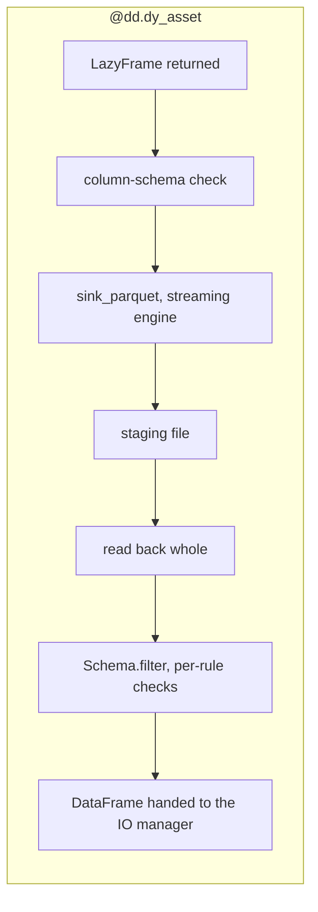

# `dagster-dataframely`

[Dataframely](https://github.com/Quantco/dataframely) describes what a [Polars](https://pola.rs) frame should look like.
[Dagster](https://dagster.io) has first-class places to show that: the Columns tab and asset checks.
The goal of `dagster-dataframely` is to wire the two together, so you describe a table once and Dagster shows it everywhere.

```python
import dagster as dg
import dataframely as dy
import polars as pl

import dagster_dataframely as dd


class Orders(dy.Schema):
    order_id = dy.String(primary_key=True)
    amount = dy.Float64(nullable=False, min=0.0)


@dd.dy_asset(Orders)
def orders(raw_orders: pl.DataFrame) -> pl.DataFrame:
    return raw_orders.select("order_id", "amount")
```

That's the whole integration.
From that one declaration you get:

- **The catalog's Columns tab**, filled in before the asset has ever run: dtypes, descriptions, nullability, uniqueness, the primary key stated once at table level, and every remaining constraint listed beside it.
- **One asset check per Dataframely rule**, each with its own pass/fail history.
- **A blocking column-schema check** that compares the frame's columns and dtypes against the schema, before a single row is filtered.
- **Somewhere for the rows that don't fit**, if you want it.
  Add `quarantine=True` and the rows that fail validation are written beside the table rather than failing the run, as long as something survives.

The decorated function is an ordinary Dagster asset body.
Upstream assets bind as parameters, you declare `context` if you want it, and you can return any of five things: a frame, or a `dg.MaterializeResult` carrying one, eager or lazy, or `None`.

```text
pl.DataFrame                dg.MaterializeResult[pl.DataFrame]
pl.LazyFrame                dg.MaterializeResult[pl.LazyFrame]
None
```

If you have metadata, tags or a data version to attach, return the result rather than the bare frame.
That's the route this package prefers, and [Attaching your own metadata](#attaching-your-own-metadata) explains why.

`@dg.asset` is the mechanism underneath, and the vocabulary.
Anything `@dg.asset` lets you say about one asset, you can say here under the same name, and a test asserts that in both directions.

## Quick start

```bash
uv add dagster-dataframely
```

You'll need Python 3.12 or newer.

`dagster`, `dataframely` and `polars` are the dependencies, plus `universal-pathlib`, which already arrives with `dagster`.

This package ships no IO manager, so bring one. [`dagster-polars`](https://docs.dagster.io/integrations/libraries/polars) writes Polars frames to a filesystem or object store, and [`dagster-duckdb-polars`](https://docs.dagster.io/integrations/libraries/duckdb) writes them to a warehouse.
Anything addressed by asset key works, because nothing here learns which manager you bound.

> [!NOTE]
> **Pre-1.0.**
> The public surface is covered by a characterization test rather than held by convention, so it won't move quietly.
> It can still move: a `0.x` minor release is where a breaking change lands.
> Pin `dagster-dataframely>=0.7,<0.8` if that matters to you.
> Coming from 0.6, read [Upgrading from 0.6](#upgrading-from-06) first.

Declare the schema and the asset as above, then tell the code location where to write:

```python
from dagster_polars import PolarsParquetIOManager

defs = dg.Definitions(
    assets=[raw_orders, orders],
    resources={"io_manager": PolarsParquetIOManager(base_dir="data/warehouse")},
)
```

`orders` binds `raw_orders`, so whatever produces that goes in the list too.
Point `dg dev` at that module and materialize `orders` from the UI, or call `dg.materialize([orders], resources=...)` from a script.

Four things now exist that didn't before:

- The catalog's Columns tab, filled from `Orders`, before the first run.
  See [Declaring an asset](#declaring-an-asset).
- One asset check per rule, each with its own history, evaluated on every run.
  See [Materializing an asset](#materializing-an-asset).
- A materialization carrying the row count, a row sample and per-dtype statistics.
  See [Materializing an asset](#materializing-an-asset).
- A table wherever your IO manager puts one.
  See [Where invalid rows go](#where-invalid-rows-go) for the other one this package can write.

The rest of this README walks through those, in the order you'll meet them.

## Declaring an asset

The schema is the only argument you have to pass, and it's positional.
Everything else either forwards to Dagster under the name Dagster already uses, or resolves through [Settings](#settings).

The decorated function is the part you write, so it's where parity with `@dg.asset` matters most:

```python
@dd.dy_asset(Orders, quarantine=True, group_name="sales")
def orders(context: dg.AssetExecutionContext, raw_orders: pl.DataFrame) -> pl.DataFrame:
    context.log.info("%d rows arrived", raw_orders.height)
    return raw_orders.select("order_id", "amount")
```

Upstream assets bind by parameter name, just as they do on a plain `@dg.asset`, and `ins=` and `deps=` cover the cases a name can't express.
Declare `context` when you want to reach the run itself: the partition key, the log, resources and configuration all hang off it.
Nothing rewrites your signature, so what you decorate stays a function you can read.

**What you return decides what happens, not how you annotated it.**
A `LazyFrame` is staged and validated whichever way the signature spells it, and a `dg.MaterializeResult` is unwrapped the same way.
`@dg.asset` does hold you to its annotation, by inferring the output's `dagster_type` from it.
This decorator can't, because validation is eager, so the asset always stores a `DataFrame` however the decorated function arrived at one.
Annotate it anyway and a type checker will hold you to it instead.
Parameterize a returned result when you do, since a bare `dg.MaterializeResult` is an implicit `Any` that a strict checker refuses.

Return a result rather than a bare frame as soon as you have something to say about the materialization.
It's the route this package prefers over the context, and the only one that survives a direct call.

Two things exist as soon as the module imports, before you run anything:

- **The Columns tab**, built from the schema.
  Dtypes, descriptions, nullability, uniqueness, the primary key at table level, and every remaining constraint beside its column.
- **A check spec per rule**, so the catalog lists the checks an asset will report and a red one has a name before it ever goes red.

The asset's description comes from the schema's docstring, which [Naming](#naming) covers.

**The schema is a single `dy.Schema`, never a `dy.Collection`.**
Passing a Collection raises `CollectionNotSupportedError` at decoration time.
Declare one asset per member instead, each with the member's own schema.
The parts under [Hand-wiring](#hand-wiring-and-how-the-package-works-under-the-hood) are no route to one either, because `process` is single-schema by signature: assembling a Collection means reimplementing the hardest part of this package rather than composing it.

## The failure policy is the asset's declaration

There's no lenient mode and no strict flag, and that's deliberate.
Declaring a quarantine **is** your consent to partial data, so what an invalid row costs is visible in the definition and can't disagree with what the asset declares.

| what was returned | the table | the quarantine | checks | run |
| --- | --- | --- | --- | --- |
| columns or dtypes that are not the schema's | not written | not written | the column-schema check fails, blocking | fails, `ColumnSchemaError` |
| every row valid | written | not written | all pass | green |
| some rows failed, no quarantine declared | not written | n/a | fail at `ERROR` | fails, `ValidationAbortError` |
| some rows failed, quarantine declared | the valid rows | the invalid rows | fail at `WARN` | green |
| every row failed, quarantine declared | skipped | every row | fail at `ERROR` | fails, `NothingSurvivedError` |
| `None`, meaning no source data | skipped | not written | all pass | green |

Six rows, and they are the six ways a run can end.
Every error this package raises lives in `dd.errors` and subclasses `dd.errors.DagsterDataframelyError`, so you can catch one by name or catch the whole family.

**Without a quarantine, every row has to be valid.**
A run with even one failing row writes nothing, so your last-known-good table stays in place.
Writing the valid rows and dropping the rest is the failure this package exists to make visible, so you can't get there by configuration.
If you want to drop rows, drop them yourself, in your own asset body, where the drop is a line you wrote:

```python
@dd.dy_asset(Orders)
def orders(raw_orders: pl.DataFrame) -> pl.DataFrame:
    valid, _ = Orders.filter(raw_orders)
    return valid
```

**Every row that failed goes to the quarantine, aborts included.**
The rows are written before the run picks its outcome, so a run that dies with `NothingSurvivedError` still leaves them where you can open them.
That is what the quarantine is for: the run that fails is the one you most want the evidence from.

## Where invalid rows go

`quarantine=True` is the whole setup.
There is no directory to configure and no second asset to declare.

**The invalid rows are written through the IO manager the asset is already bound to**, under the asset's own key with `_quarantine` on the end.
`analytics/orders` puts them at `analytics/orders_quarantine`.
Nothing in this package learns which manager that is: every asset-key-addressed IO manager already turns a key into its own address, so one suffix places the quarantine natively on every backend (ADR-0006).

That means one declaration and two outcomes, rather than two integrations:

```python
@dd.dy_asset(Orders, quarantine=True)
def orders(raw_orders: pl.DataFrame) -> pl.DataFrame:
    return raw_orders.select("order_id", "amount")
```

| what you bound | where the invalid rows land |
| --- | --- |
| `PolarsParquetIOManager` | `orders_quarantine.parquet`, beside `orders.parquet` |
| `DuckDBPolarsIOManager` | the table `orders_quarantine`, beside `orders` in the same schema |

The first is a `UPathIOManager` and the second is a `DbIOManager`, which are the two base classes Dagster ships.
Between them they cover nearly every first-party manager.

The rows carry their original columns, then one `String` column per rule reading `valid`, `invalid` or `unknown`, named exactly as that rule's asset check.
The valid table's materialization carries the address they went to, how many there were, and which sets of rules they broke together; see [Materializing an asset](#materializing-an-asset).

**A partitioned asset on a database manager needs `partition_expr`.** `DbIOManager` raises without it, and you already declare it for your own partitioned table.
It reaches the quarantine automatically, on the definition metadata the write carries.

**`quarantine=True` adds a `context` parameter to the asset**, whether or not your function declared one.
The writer is built from the execution context, and a wrapper can't ask Dagster for a parameter it didn't declare.
Calling such an asset therefore takes a `dg.build_asset_context()` first; see [Testing an asset](#testing-an-asset).
An asset without a quarantine keeps exactly the signature you wrote.

### The quarantine is not an asset

It's evidence of a run.
It holds no place in the graph, receives no materialization event, and nothing downstream can depend on it until you say so.

`build_quarantine_spec` is how you say so:

```python
defs = dg.Definitions(
    assets=[raw_orders, orders, dd.build_quarantine_spec(Orders, orders)],
    resources={"io_manager": PolarsParquetIOManager(base_dir="data/warehouse")},
)
```

That returns a `dg.AssetSpec` keyed `orders_quarantine`, depending on `orders`, with its own Columns tab: the schema's columns mirrored with **no** constraints, because these rows are here for breaking them, then one column per rule.
It has no compute, because the decorator already wrote the rows.
The spec's key resolves through the same IO manager the write used, so a downstream asset can name it as an input and read it back with no routing at all.

The schema is passed explicitly because nothing on an `AssetsDefinition` carries the live class.
Pass the asset itself and its partitions come along; pass a key form and use `partitions_def=` instead.
Passing both raises `dg.DagsterInvariantViolationError`.

**It never receives a materialization event.**
Nothing materializes it, and saying otherwise would be a lie the catalog then repeats.
That is the fact to design around if you want to automate on invalid rows; see [Automation](#automation).

### `quarantine_dir` is for calling, not running

A call has no step, so there is no IO manager to write through.
`DAGSTER_DATAFRAMELY_QUARANTINE_DIR` is the directory the rows go to on that path, and it is read on that path only.

```bash
DAGSTER_DATAFRAMELY_QUARANTINE_DIR=/tmp/quarantine
```

Unset, calling a quarantined asset raises `QuarantineDirError` rather than choosing a directory on your behalf.
The rows are evidence, and writing them somewhere nobody named is how evidence gets lost.

There is deliberately no per-asset override.
A directory is meaningless to a warehouse, so the three cases an override would serve are recorded in ADR-0006 and deferred until somebody needs one.

Under that directory the layout mirrors `UPathIOManager`, with the key and partition spelling the rest of the file path:

```text
<quarantine_dir>/<key part>/.../<name>_quarantine.parquet
<quarantine_dir>/<key part>/.../<name>_quarantine/<partition>.parquet
```

## A partition with no data

Some partitions have no source data, and never will.
A monthly x distributor grid where one distributor left the marketplace two years ago is the shape: its historical partitions hold real data and must stay, its recent ones have no file.

That's not a failure, and it isn't an empty table either.
Return `None` and the asset skips: nothing is validated, nothing materializes, and the run stays green, so the partition stays unmaterialized instead of going green with zero rows or red with an error.

```python
@dd.dy_asset(SupplierReport, partitions_def=grid)
def supplier_reports(context: dg.AssetExecutionContext) -> pl.DataFrame | None:
    path = source_path(context.partition_key)
    if not path.exists():
        return None
    return pl.read_parquet(path)
```

**The existence test is yours to write.**
The decorator never catches `FileNotFoundError`, or anything else, to decide this for you.
It can't tell a file that's legitimately absent from a path that's misconfigured, and guessing wrong would turn a broken pipeline into a silently missing partition.
`None` is how you say the first; letting the error escape is still how you say the second.

**Every check still reports on a skipped run, and passes.**
That isn't politeness.
A check spec is a non-optional output whatever the asset declares, so a step that answers none of them fails outright, and `@dg.asset(output_required=False)` hits the same wall the moment it declares one check.
So the rules are run over an empty frame and report what that says.
Nothing is fabricated: every rule was evaluated, over zero rows, and none was violated.
Dagster attaches those evaluations to no materialization, so a passing check on a skipped partition doesn't claim to have checked the last one that had data.

`dg.MaterializeResult(value=None)` is refused rather than read as the skip.
A returned result exists to put metadata, tags or a data version on a materialization, and a skipped run has none, so there's nowhere for the rest of the object to go.

## The package never casts

The column-schema check compares your frame's dtypes against the schema's and aborts on a mismatch, and the filter runs with `cast=False`.
A `Duration('ns')` arriving where the schema declares `Duration('us')` is a pipeline defect, and silently widening it is how a thousandfold error reaches a table nobody re-reads.

If you do want conformance, write the cast yourself, in your own asset body, where you can see it:

```python
@dd.dy_asset(Orders)
def orders(raw_orders: pl.DataFrame) -> pl.DataFrame:
    return Orders.cast(raw_orders)
```

That is also what a warehouse read needs.
DuckDB returns `DECIMAL` where the schema declares `Float64`, so an asset reading from `DuckDBPolarsIOManager` meets the column-schema check on its first run unless it casts ([#88](https://github.com/ozanozbeker/dagster-dataframely/issues/88)).

The one cast the package makes is on columns it generated itself: the quarantine's rule columns go from `Enum` to `String`, because a raw `Enum` panics the Delta writer.

## Materializing an asset

Launching is Dagster's business and works the way it always does: materialize from the UI, from a schedule or a sensor, or call `dg.materialize([orders], resources={...})`.
What the run leaves behind is the part this package is for, and it lands on two surfaces.

**The table's materialization.**
Everything this package writes there sits under `dataframely/`, so it sorts in one block apart from Dagster's own keys and your IO manager's.

| key | what it holds |
| --- | --- |
| `dagster/row_count` | how many rows passed validation, not how many arrived |
| `dataframely/valid_sample` | the first few of those rows |
| `dataframely/valid_stats/<family>` | one table per dtype family present: `numeric`, `temporal`, `string`, `boolean` |
| `dataframely/quarantine_address` | where the invalid rows went, on the runs that wrote any |
| `dataframely/invalid_count` | how many rows failed at least one rule |
| `dataframely/invalid_sample` | the first few of those, rule columns included |
| `dataframely/invalid_by_rules` | which sets of rules the rows broke together, biggest group first |

The last four are absent on a clean run, where there is nothing to say.
`dataframely/invalid_by_rules` is what stops one broken upstream field that trips three rules reading as three unrelated counts.

**The checks.**
The column-schema check reports first and blocks, then one check per rule, or fewer once `check_granularity` collapses them.
A single-rule check carries `dy_rule` and `dy_rule__expr`, plus `dy_failed_count` and up to `max_failure_samples` rows under `dy_failed_sample`.
A collapsed check carries `dy_rules`, a row per member rule, and one `dy_failed_sample` with `dy_rule` prepended so each row names the rule that put it there.
Severity follows the run's outcome rather than the rule: a failing row with a quarantine to go to is a `WARN`, and the same row with nowhere to go is an `ERROR`.

On the two exits that raise there is no materialization to carry the address, so `dataframely/quarantine_address` is copied onto every check result instead.
A reader looking at a failed run finds it wherever they look.

The Columns tab isn't a run surface.
It comes off the definition, so it's filled in before the first run and stays filled after a failed one.

## Testing an asset

To test an asset, call it.
Direct invocation is Dagster's documented unit-testing path, and here it costs you nothing: no run, no IO manager, no instance.
A call hands back the same materializations and check results a run yields, as ordinary Python objects, and the validated frame comes off `value`:

```python
# conftest.py: set before your assets are imported, not inside the test.
import os
import tempfile

os.environ.setdefault("DAGSTER_DATAFRAMELY_QUARANTINE_DIR", tempfile.mkdtemp())
```

```python
import os
import pathlib

QUARANTINE_DIR = pathlib.Path(os.environ["DAGSTER_DATAFRAMELY_QUARANTINE_DIR"])


@dd.dy_asset(Orders, quarantine=True)
def orders(raw_orders: pl.DataFrame) -> pl.DataFrame:
    return raw_orders.select("order_id", "amount")


def test_orders_quarantines_the_negative_amount():
    raw_orders = pl.DataFrame({"order_id": ["a", "b", "c"], "amount": [1.0, 2.0, -3.0]})

    events = list(orders(dg.build_asset_context(), raw_orders))
    tables = {
        event.asset_key: event.value
        for event in events
        if isinstance(event, dg.MaterializeResult)
    }
    checks = {
        event.check_name: event.passed
        for event in events
        if isinstance(event, dg.AssetCheckResult)
    }

    assert tables[dg.AssetKey(["orders"])].height == 2
    assert not checks["dy_rule__amount__min"]
    assert pl.read_parquet(QUARANTINE_DIR / "orders_quarantine.parquet").height == 1
```

> [!WARNING]
> **`DAGSTER_DATAFRAMELY_QUARANTINE_DIR` is read when the asset is declared, not when it's called.**
> A `monkeypatch.setenv` inside the test is too late: the module holding the asset has already imported, and the call raises `QuarantineDirError` telling you to set the variable you just set.
> That is [#115](https://github.com/ozanozbeker/dagster-dataframely/issues/115), and until it lands the variable has to be in the environment before your assets import.

Two things about that call are worth reading twice.

**The quarantine is written, not yielded.**
There is one materialization, for the table, so the invalid rows are read off disk rather than off an event.
That is the same asymmetry a run has, where the rows go through the IO manager and never become an event either.

**A quarantined asset takes a context**, because `quarantine=True` added the parameter.
It comes first and the frames follow, exactly as Dagster orders them.
The `DAGSTER_DATAFRAMELY_QUARANTINE_DIR` above is what a call needs in place of the IO manager it doesn't have; see [`quarantine_dir` is for calling, not running](#quarantine_dir-is-for-calling-not-running).

An asset without a quarantine needs neither:

```python
@dd.dy_asset(Orders)
def plain_orders(raw_orders: pl.DataFrame) -> pl.DataFrame:
    return raw_orders.select("order_id", "amount")


clean = pl.DataFrame({"order_id": ["a", "b"], "amount": [1.0, 2.0]})
events = list(plain_orders(clean))
```

Every check the asset declares comes back, standalone and fully addressed, so a call and a run report the same names against the same keys.
The keys are resolved where you declared the asset rather than looked up from a running step, which is what makes them knowable outside a run.

If the decorated function declares a `context` of its own, build one with `dg.build_asset_context()`.
A partitioned root asset takes one and nothing else, so its whole call is a context carrying the key:

```python
@dd.dy_asset(Orders, partitions_def=daily)
def daily_orders(context: dg.AssetExecutionContext) -> pl.DataFrame:
    return pl.read_parquet(f"raw/orders/{context.partition_key}.parquet")


events = list(daily_orders(dg.build_asset_context(partition_key="2026-01-02")))
```

An asset that aborts raises out of the call, so `pytest.raises(dd.errors.ValidationAbortError)` is how you test the policy itself, and `dd.errors.ColumnSchemaError` is how you test a drifting frame.

**A decorated function that attaches metadata through the context is the one thing you can't test this way.** `context.add_asset_metadata` raises under a direct call:

```text
AttributeError: 'DirectAssetExecutionContext' object has no attribute '_step_execution_context'
```

A plain `@dg.asset` raises the same thing, so this is Dagster's gap rather than something this package introduces.
A returned `dg.MaterializeResult` has no such gap: its metadata, tags and data version all come back on the object the call yields, which is one more reason to prefer it.

## Attaching your own metadata

Use the context to read the run.
Use the return to write the materialization.

**Return a `dg.MaterializeResult` carrying the frame.**
It's what `@dg.asset` accepts, it's the only supported route to a materialization's tags and data version, and it survives direct invocation:

```python
@dd.dy_asset(Orders)
def orders(raw_orders: pl.DataFrame) -> dg.MaterializeResult[pl.DataFrame]:
    return dg.MaterializeResult(
        value=raw_orders.select("order_id", "amount"),
        metadata={"source": "stripe", "extracted_at": "2026-08-13"},
        data_version=dg.DataVersion("2026-08-13"),
        tags={"run/flavour": "backfill"},
    )
```

`value` is the frame to validate, and you have to set it.
`metadata`, `data_version` and `tags` land on the table's materialization, which is the only one there is.
`asset_key` and `check_results` are refused by name, because the decorator decides the key from what it was declared with and the check results from the schema's rules.

**This package's own metadata keys win a collision.**
A returned `dagster/row_count` loses to the count this package made, and so does anything under `dataframely/`.
Those keys are this package's surface, so a collision is a mistake rather than an override.
Everything else you attach is yours, and it's carried through untouched.

### The context route

`context.add_asset_metadata` is the other way in, and it's what older Dagster examples reach for.
Nothing here blocks it, and since the decorator builds one asset with one key, the bare call works:

```python
@dd.dy_asset(Orders)
def orders(context: dg.AssetExecutionContext, raw_orders: pl.DataFrame) -> pl.DataFrame:
    context.add_asset_metadata({"source": "stripe"})
    return raw_orders.select("order_id", "amount")
```

Two things about it are worth knowing, and one neighbouring call is worth avoiding.

**It overrides this package's own keys, where a returned result loses to them.**
Dagster builds an event's metadata from the output's first and applies the context's accumulator last.
So `context.add_asset_metadata({"dagster/row_count": 999})` puts 999 in the catalog for a table with two rows.
Nothing here can defend against that, because the merge happens after this package has yielded.

**`context.set_data_version` isn't supported.**
It's mentioned here so you know why it's missing rather than going looking for it: it carries no `@public`, and you can't reach it by calling the asset.
Return `data_version=` on a `dg.MaterializeResult` instead, which produces the same event tags.

One more call looks right and isn't: `context.add_output_metadata`.
Every asset check is an output, and this package always declares at least the column-schema check, so an asset here always has several:

```text
DagsterInvariantViolationError: Attempted to add metadata without providing output_name, but multiple outputs exist. Please provide an output_name to the invocation of `context.add_output_metadata`.
```

Naming the output does work, but the output name is the asset's name and not its key, so under a `key_prefix` you'd be hardcoding a string the catalog never shows you.
Reach for `add_asset_metadata` instead.

> [!NOTE]
> `add_asset_metadata`, `set_data_version` and `add_output_metadata` are the whole of what this package has checked against Dagster's context, and no more will be checked.
> Nothing is guaranteed about the rest of that surface, now or in a future Dagster.
> If you find another method that works and is worth teaching, [open an issue](https://github.com/ozanozbeker/dagster-dataframely/issues).

## Partitioning

`partitions_def` forwards to the underlying `dg.asset` verbatim, so partitioning needed no code here and has no setting of its own.
The quarantine is written under the same partition key, which is what stops it escaping its asset's partitioning.
Validation runs per partition on that partition's frame, `dagster/row_count` is that partition's valid count, and a partition whose frame drifts aborts at the column-schema check without touching any other partition's data.

**A root asset reaches its own partition key through a declared `context`.**
Root, because nothing upstream of it is a Dagster asset, so finding today's file is its own job:

```python
daily = dg.DailyPartitionsDefinition(start_date="2026-01-01")


@dd.dy_asset(Orders, partitions_def=daily)
def orders(context: dg.AssetExecutionContext) -> pl.DataFrame:
    day = context.partition_key  # "2026-01-02"
    raw = pl.read_parquet(f"raw/orders/{day}.parquet")
    return raw.select("order_id", "amount")
```

That's how a partitioned `@dg.asset` does it, and this decorator is no different.
It's also what keeps the decorated function testable, since `dg.build_asset_context(partition_key=...)` can supply a key and nothing else can; see [Testing an asset](#testing-an-asset).

**Downstream of it, the key stops being your problem.**
An asset on the same partitions gets that partition's rows bound to the parameter, because the IO manager read the one file:

```python
@dd.dy_asset(Orders, partitions_def=daily)
def priority_orders(orders: pl.DataFrame) -> pl.DataFrame:
    # orders is one partition's rows, the same shape unpartitioned code sees
    return orders.filter(pl.col("amount") > 100)
```

No `context`, no key, no path.
This is the body you'd write with no partitioning at all, which is the point: partitioning is a property of the asset, not of the code inside it.

**A fan-in over every partition arrives as one frame per partition.**
An unpartitioned asset that depends on the whole of a partitioned one gets a dict instead, because the IO manager reads every key and assembles the results:

```python
@dd.dy_asset(Orders)
def rollup(orders: dict[str, pl.DataFrame]) -> pl.DataFrame:
    # orders == {
    #     "2026-01-01": pl.DataFrame,   # that day's rows
    #     "2026-01-02": pl.DataFrame,
    # }
    return pl.concat(orders.values())
```

Annotate the dict, not the frame.
The obvious annotation, `pl.DataFrame`, fails Dagster's type check after every partition has already been read.

**Swap the element type and the whole fan-in goes lazy:**

```python
@dd.dy_asset(Orders)
def rollup(orders: dict[str, pl.LazyFrame]) -> pl.LazyFrame:
    # orders == {
    #     "2026-01-01": pl.LazyFrame,   # a scan of that day's file
    #     "2026-01-02": pl.LazyFrame,
    # }
    return pl.concat(orders.values())
```

Every value is now that partition's scan rather than its rows, so the concat is one plan over every partition and nothing is read until the sink runs.
That's the difference worth having at a hundred partitions: the eager spelling holds all of them in memory at once, and this one holds the engine's buffers.
The keys are the same either way, and so is the validation that follows: the plan is staged, read back and filtered exactly as [`LazyFrame`s](#lazyframes) describes for a single one.

**A `MultiPartitionsDefinition` needs nothing special either.**
It forwards like any other, so a grid partitions the asset and the quarantine cell for cell:

```python
grid = dg.MultiPartitionsDefinition(
    {
        "day": dg.DailyPartitionsDefinition(start_date="2026-01-01"),
        "region": dg.StaticPartitionsDefinition(["eu", "us"]),
    }
)


@dd.dy_asset(Orders, partitions_def=grid)
def orders(context: dg.AssetExecutionContext) -> pl.DataFrame:
    cell = context.partition_key.keys_by_dimension  # {"day": ..., "region": ...}
    raw = pl.read_parquet(f"raw/orders/{cell['region']}/{cell['day']}.parquet")
    return raw.select("order_id", "amount")


@dd.dy_asset(Orders, partitions_def=grid, quarantine=True)
def priority_orders(
    context: dg.AssetExecutionContext, orders: pl.DataFrame
) -> pl.DataFrame:
    # orders is one cell's rows: one day, one region
    return orders.filter(pl.col("amount") > 100)
```

The root one handles the grid; the one below it doesn't, exactly as with a single dimension.
That is worth saying because a grid looks like it should arrive nested, and it never does: an asset on the same grid gets **one** frame, the cell it's running for.

`context.partition_key` is a `dg.MultiPartitionKey`, a `str` subclass rendering as `2026-01-01|eu`.
Read a dimension off `keys_by_dimension` rather than splitting that string, because the string's order isn't yours: both it and the paths below sort by dimension name, so renaming a dimension reorders them.

Under a `UPathIOManager`, that's one file per cell, nested one directory per dimension:

```text
orders/2026-01-01/eu.parquet
orders/2026-01-01/us.parquet
priority_orders/2026-01-01/eu.parquet
priority_orders_quarantine/2026-01-01/eu.parquet
```

**A fan-in over a grid is flat, not nested.**
One entry per cell, keyed by the same rendering:

```python
@dd.dy_asset(Orders)
def eu_orders(orders: dict[dg.MultiPartitionKey, pl.LazyFrame]) -> pl.LazyFrame:
    # orders == {
    #     "2026-01-01|eu": pl.LazyFrame,   # one cell, one scan
    #     "2026-01-01|us": pl.LazyFrame,
    #     "2026-01-02|eu": pl.LazyFrame,
    #     "2026-01-02|us": pl.LazyFrame,
    # }
    return pl.concat(
        frame
        for key, frame in orders.items()
        if key.keys_by_dimension["region"] == "eu"
    )
```

Every key is a `MultiPartitionKey` at runtime, so grouping by a dimension is a `keys_by_dimension` read rather than a parse of the string.
Spelling the key type in the annotation, as above, is what makes that read type-check as well as run; `dict[str, pl.LazyFrame]` is accepted too and leaves you casting.

Collapsing one dimension is a partition mapping and nothing more.
An asset partitioned by `day` alone, depending on the grid through `dg.MultiToSingleDimensionPartitionMapping(partition_dimension_name="day")`, gets that day's regions and nothing else: two entries rather than four, still keyed `2026-01-02|eu` and `2026-01-02|us`.

## Automation

`automation_condition` and `freshness_policy` forward to `dg.asset` verbatim, like everything else, and they cover the asset.

There's nothing to wire up to the quarantine, and nothing you can wire up.
The rows are written inside the asset's own step, with no schedule, sensor or condition in between, and the quarantine emits no materialization event.
So `dg.AutomationCondition.eager()` on a downstream asset has nothing to react to, however you declare it.

**Automate on the check instead.**
A rule that failed is a red check with its own history, which is the surface Dagster gives you for exactly this:

```python
@dg.asset_check(asset=orders, name="triage_needed")
def triage_needed() -> dg.AssetCheckResult: ...
```

Or read the quarantine on a schedule, through the spec `build_quarantine_spec` gives it.
What you can't do is treat it as an event source, and that's a property of it being evidence rather than an asset.

## `LazyFrame`s

Two seams meet a `pl.LazyFrame`, and they read it differently on purpose.
A read has no object yet, so the annotation is the only signal it has.
Validation refuses to stay lazy at all.

A `dy_asset` sinks your plan to a staging file on the streaming engine and reads the result back, because the rules can only be evaluated over rows in memory.
The engine still does the work; what this pays for is holding what the engine produced.



### Reads dispatch on the annotation

Annotate an input `pl.LazyFrame` and the IO manager hands back an unexecuted scan, so a downstream `filter` or `select` prunes rows and columns before anything is decoded:

```python
@dd.dy_asset(Orders)
def recent(orders: pl.LazyFrame) -> pl.LazyFrame:
    return orders.filter(pl.col("amount") > 100)
```

The read is the IO manager's, so this is a property of the one you bound rather than of this decorator, and the annotation works the same on a plain `@dg.asset`.
Annotate `pl.DataFrame` instead and the file is read whole.

### Validation materializes

`Schema.filter` collects, so a validated frame is a frame in memory.

**A `LazyFrame` return streams to a local parquet first, then is read back whole and validated exactly as a `DataFrame` return is.**

```python
@dd.dy_asset(Orders)
def orders(raw_orders: pl.LazyFrame) -> pl.LazyFrame:
    return raw_orders.filter(pl.col("amount") > 0).select("order_id", "amount")
```

Your joins, filters and aggregations therefore run in the streaming engine, which the sink names rather than leaves to `auto`: an engine that chose to collect would pay the write and keep the peak anyway.
What comes back into memory is what the plan produced, not the plan.
Peak memory is then the size of that result rather than the plan's own high-water mark.
That is the saving for a plan with a large intermediate: a join that fans out before filtering back down otherwise pays for the fan-out in memory.
A `DataFrame` return skips the staging, because a frame you already materialized has nothing left to stream and staging it would be pure cost.
The column-schema check runs before the staging, so a frame whose columns disagree with the schema is refused before a single row is streamed, and the staging file is removed whichever way the run ends.

> [!IMPORTANT]
> The staging file goes to the system temp directory, which in a container is its **ephemeral disk**.
> A staged frame bigger than what the pod has spare fills it.
> `temp_dir` points it at a mounted volume instead.

What stays eager is storage, not the computation.
This package doesn't promise to write a table.
It promises to write a table and report on it.
`dy.FailureInfo` is eager by construction, the statistics pass runs two global aggregates, and validation can't choose among its exits without counting both halves of the split.
So the exits whose whole purpose is that nothing gets written would have to execute the plan to learn that.
A plain `@dg.asset` streams end to end, sink to storage with nothing read back, because it has none of those duties: no schema means no validation, no per-rule checks and no statistics pass, so nothing forces the result into memory.
The measurements are in [`docs/research/lazyframe-end-to-end.md`](docs/research/lazyframe-end-to-end.md).

This package is built for post-ingest work: bronze to silver to gold, where the data is already on your side and the question is whether it's fit to publish.
Ingestion-scale and larger-than-memory work belongs to other tools.

## Settings

Every setting resolves in order, each overriding the one before: the package default, then an environment variable, then the argument on the asset.
That way a platform engineer sets a house style once for a whole code location, and you override it on the one asset where that style is wrong.
Each variable is `DAGSTER_DATAFRAMELY_` plus the setting's name, upper-cased.

| setting | what it decides | default |
| --- | --- | --- |
| `check_granularity` | how far the schema's rules collapse into checks: `rule`, `column` or `schema` | `rule` |
| `multi_column_rules` | where the rules no single column owns land at `column` granularity: `schema` or `per_rule` | `schema` |
| `statistics` | whether each materialization carries statistics for what it wrote | `true` |
| `max_failure_samples` | how many of the rows that failed a rule reach that rule's check | `5` |
| `row_sample` | how many rows reach the materialization, of what was written and of what failed | `5` |
| `temp_dir` | which disk a `LazyFrame` is staged on, before it's validated | the system temp directory |
| `quarantine_dir` | where invalid rows go when the asset is called rather than run | unset, and calling raises |

`quarantine_dir` is the one with two sources rather than three: there is no argument for it, because that would be the override ADR-0006 defers.

The chain validates on resolve, whichever source supplied the value, the package's own included, so a typo raises `InvalidSettingError` naming the value and where it came from, rather than quietly becoming something else three modules later.

### Changing `check_granularity` orphans check history

`rule` gives every rule its own check and its own history.
`column` gives one check per rule-bearing column, `dy_col__<column>`, which is what makes a 40-column schema's check list readable.
`schema` gives a single `dy_schema__rules` for all of them.

**Changing it on an asset that has already run orphans that asset's check history.**
The old check names stop being reported and their histories end where the change landed, while the new ones start empty.
Nothing migrates them, so choose it before the asset ships rather than after.

### Statistics and both samples are on by default

Each materialization carries `skimr`-style statistics for what it wrote: one table per dtype family present, under `dataframely/valid_stats/numeric`, `/temporal`, `/string` and `/boolean`.
The invalid rows get none, deliberately: what they look like in aggregate is a question about a table nobody consumes.

> [!IMPORTANT]
> Two of the settings write **real rows of your data into the Dagster event log**, and both ship on.
> The event log is shared across a deployment, it's exportable, and nothing here is redacted.
> If a column holds an email address, a name or an account number, that value lands in the log and stays there.

| setting | what it writes | where |
| --- | --- | --- |
| `max_failure_samples` | up to this many of the rows that failed each rule | that rule's asset check, under `dy_failed_sample` |
| `row_sample` | up to this many rows of each half of the split | the materialization, under `dataframely/valid_sample` and `dataframely/invalid_sample` |

One number governs both halves, so consenting to a sample is one decision rather than two.

Dataframely's own comparable setting defaults to `0`, so this package is deliberately the more generous of the two.
The reason is that a red check raises exactly one question the counts can't answer: not that 43 rows failed `amount|min`, but what three of those rows held.
Paying for that in the event log should be a decision, which is what this section is for.

Set either to `0` and it's off entirely, with the metadata key absent rather than empty.
Per asset:

```python
@dd.dy_asset(Orders, max_failure_samples=0, row_sample=0)
def orders(raw_orders: pl.DataFrame) -> pl.DataFrame:
    return raw_orders.select("order_id", "amount")
```

Or once for a whole code location, in the deployment's environment:

```bash
DAGSTER_DATAFRAMELY_MAX_FAILURE_SAMPLES=0
DAGSTER_DATAFRAMELY_ROW_SAMPLE=0
```

Turning the samples off leaves `statistics` on.
The string family deliberately carries no value-bearing statistic at any setting, only lengths and cardinality: consenting to summary statistics is not consenting to raw values.

### `temp_dir` decides which disk a lazy frame is staged on

One path reads it, and it is the lazy one, so an asset that returns a `DataFrame` is unaffected by whatever it holds.

Unset, the staging file goes wherever `tempfile` puts things, which in a container is the ephemeral disk its `/tmp` sits on.
That disk is usually small, it's shared with everything else in the pod, and filling it takes the pod down rather than failing the asset.
Point it at a volume for the whole code location:

```bash
DAGSTER_DATAFRAMELY_TEMP_DIR=/mnt/staging
```

Or per asset, where one of them is the one with the large intermediate:

```python
@dd.dy_asset(Orders, temp_dir="/mnt/staging")
def orders(raw_orders: pl.LazyFrame) -> pl.LazyFrame:
    return raw_orders.filter(pl.col("amount") > 0).select("order_id", "amount")
```

A directory that doesn't exist raises rather than being created, and an empty value raises rather than reading as unset.
Both are the same decision: you set this to move the staging file off the ephemeral disk, so a typo that quietly stages there anyway is the failure it exists to prevent.

## Naming

Three things this package names rather than leaving to Dagster: the asset's description, the op underneath it, and the namespaces its own keys sit under.

### The description comes from the schema

`@dy_asset` resolves the asset's description in order, most specific first: `description=` on the decorator, then the schema's own docstring, then Dagster's own fallback to the decorated function's docstring.

```python
class Orders(dy.Schema):
    """Customer orders, one row per order line."""


@dd.dy_asset(Orders)
def orders() -> pl.DataFrame:
    """Joins the two extracts and drops the test accounts."""
    ...
```

`Customer orders, one row per order line.` is what the catalog reads.
The schema outranks it because the schema describes the table, whereas the function's docstring describes the code that fills it, and the two are rarely the same sentence.
Passing `description=` still wins over both, and a schema with no docstring leaves the function's standing exactly as it did before.

A quarantine spec writes its own: `Invalid rows from <asset>, with a column per rule saying why.`

### The op is named after the whole asset key

`@dy_asset(Orders, key_prefix="sales", name="orders")` builds an op called `sales__orders`, which is how `@dg.asset` names its own.
The asset name alone won't do, because an op name has to be unique across a code location and an asset name is not.
Two assets sharing a name under different prefixes would be two ops called the same thing.
Dagster allows a repeated op name only where the two definitions compare equal, and two of these never are, since every check output name embeds its own asset key.

The op name is the step key and the address run config resolves against, so both spell the whole key:

```yaml
ops:
  sales__orders:
    config:
      threshold: 4
```

### The reserved namespaces

There are two, because Dagster forces the split.

**`dy_`** covers every check name, every quarantine rule column and every key in check metadata: the column-schema check `dy_schema__columns`, the rule checks `dy_rule__<rule>`, the collapsed checks `dy_col__<column>` and `dy_schema__rules`, and the metadata keys `dy_rule`, `dy_rule__expr`, `dy_rules`, `dy_failed_count`, `dy_failed_sample` and `dy_schema__errors`.
A check name becomes an op output, which Dagster validates against `^[A-Za-z0-9_]+$`, so a slash is not available there.

**`dataframely/`** covers every key on a materialization, which has no such limit.
It parallels Dagster's own `dagster/`, so everything this package writes sorts in one block apart from Dagster's keys and your IO manager's.

A schema with a column of its own inside `dy_` raises `ReservedColumnError` at definition time, and two rules that rewrite to one check name raise `CheckNameCollisionError`.
Both prefixes are hardcoded rather than configurable: their whole value is being the same string in every project.

## Two ways to get this wrong

**A `from __future__ import annotations` in your own module breaks an annotated `context` parameter.**
Under PEP 563 every annotation reaches Dagster as a string.
Its check on the `context` parameter compares against the real classes, so it refuses `context: dg.AssetExecutionContext` and `context: AssetExecutionContext` alike:

```text
DagsterInvalidDefinitionError: Cannot annotate `context` parameter with type dg.AssetExecutionContext.
`context` must be annotated with AssetExecutionContext, AssetCheckExecutionContext, OpExecutionContext, or left blank.
```

That's Dagster's restriction rather than one this package imposes.
`@dg.asset` refuses the same annotation with the same message, and both accept the parameter left blank, which is the one option in that message PEP 563 leaves standing:

```python
@dd.dy_asset(Orders)
def orders(context) -> pl.DataFrame:
    context.log.info("run %s", context.run_id)
    return pl.read_parquet("raw/orders.parquet").select("order_id", "amount")
```

**A `@dy.rule()` body needs its class parameter.**
Write one without it and the class still builds and the asset still defines.
The run then fails when this package reads the rule's expression for the check metadata:

```text
TypeError: Orders.amount_is_positive() takes 0 positional arguments but 1 was given
```

`@dy.rule()` is a classmethod-style decorator, so the body takes `cls`:

```python
class Orders(dy.Schema):
    status = dy.String(nullable=False)
    amount = dy.Float64(nullable=False)

    @dy.rule()
    def paid_orders_have_amount(cls) -> pl.Expr:
        """Paid orders must carry a positive amount."""
        return (cls.status.col != "paid") | (cls.amount.col > 0)
```

The docstring isn't decoration: it becomes that check's description in the catalog.

## Hand-wiring (and how the package works under the hood)

The decorator is one arrangement of parts the package also exports under `dd.wiring`: `check_specs`, `schema_metadata`, `table_schema`, `quarantine_frame`, `quarantine_path`, `delegating_writer`, `file_writer`, `process`, `check_name`, and the `QuarantineWriter` and `AssetYield` types they trade in.
Reach for them when the decorator's shape isn't the shape you need: a schema attached to an asset you didn't declare, or a reporting arrangement the decorator doesn't offer.
The asset is then yours to declare, out of the same parts.

They sit in their own namespace rather than the root because the decorator is the happy path, and if you never hand-wire you shouldn't have to read past `quarantine_frame` to find it.

The three arrangements below descend.
The first is close to what the decorator builds, each one after it gives up a piece, and the last is what you'd be writing if this package didn't exist.
`orders_frame()` stands in for whatever produces your frame, since none of them care where it came from.

### The decorator is a `@dg.asset`, a writer and `process`

The schema's metadata and check specs go straight on the asset, and `process` does the rest:

```python
@dg.asset(
    metadata=dd.wiring.schema_metadata(Orders),
    check_specs=dd.wiring.check_specs(Orders, asset="orders"),
    output_required=False,
)
def orders(context: dg.AssetExecutionContext) -> dd.wiring.AssetYield:
    yield from dd.wiring.process(
        Orders,
        orders_frame(),
        valid_key=context.asset_key,
        quarantine_writer=dd.wiring.delegating_writer(context),
    )
```

That is the Columns tab, one check per rule, the row filter, and the invalid rows written beside the table.
`context.asset_key` is the whole of the key resolution, because a single-output asset has exactly one key to resolve.

`output_required=False` is what lets the column-schema check, both abort paths and the skip end the step without yielding.
Leave it off and every path that doesn't raise has to yield the output.

`quarantine_writer` is the whole of the failure policy.
`delegating_writer(context)` takes the IO manager the asset is already bound to and hands it the invalid rows under the key `<name>_quarantine`, so they land wherever that manager puts things.
Pass nothing instead and invalid rows abort the run, exactly as they do when the decorator is given `quarantine=False`.

`delegating_writer` needs a real step, so it raises under direct invocation.
`file_writer(context.asset_key, quarantine_dir, partition_key)` is what the decorator reaches for there, and you can reach for it on the same terms.

An asset that writes its own storage and never holds a frame can still take `schema_metadata` on its own, for the Columns tab alone.
`process` is the part that needs a frame; the metadata isn't.

### Split the checks off entirely

The arrangement above hands its frame to `process`, and `process` is what fuses the write and the checks into one step.
Pull them apart and the asset goes back to being an ordinary one that returns a frame; the checks become a `@dg.multi_asset_check` of their own, reading the table back through the IO manager:

```python
from collections.abc import Iterator

KEY = dg.AssetKey(["orders"])


@dg.asset(metadata=dd.wiring.schema_metadata(Orders))
def orders() -> pl.LazyFrame:
    return orders_frame()


@dg.multi_asset_check(specs=dd.wiring.check_specs(Orders, asset=KEY))
def orders_checks(orders: pl.LazyFrame) -> Iterator[dg.AssetCheckResult]:
    try:
        for result in dd.wiring.process(
            Orders, orders, valid_key=KEY, statistics=False, row_sample=0
        ):
            if isinstance(result, dg.AssetCheckResult):
                yield result
    except (dd.errors.ValidationAbortError, dd.errors.NothingSurvivedError):
        pass
```

This is the arrangement to reach for when the write must not depend on the verdict: the asset returns its frame, lazy or eager, the IO manager writes whatever it returned, and the checks run afterwards against what was written.
What you give up is the guarantee the decorator exists for.
The table is written before anything is validated, so a bad table reaches storage and the red check is what tells you.
The decorator would have refused to write it at all.

Three details earn their place in that block:

- **`statistics=False, row_sample=0`.**
  Both settings only ever feed a materialization, and this step discards every one `process` yields, so leaving them on would pay for tables nobody sees.
  `max_failure_samples` stays on: it feeds the checks, which is the whole output here.
- **The `try`.** `process` carries the decorator's failure policy, so it raises once rows fail with nowhere to route them.
  A checks-only step wants the report without the policy, and both errors are raised after their check results have already been yielded, so catching them keeps every check and drops the abort.
  Failing rows then leave the run green with a red `ERROR` check, which is what an asset check is for.
- **`ColumnSchemaError` is deliberately not caught.**
  A dtype drift means `process` never got as far as the rules, so there is nothing to report for them: one check comes back red and the step fails, rather than six checks claiming a pass nobody evaluated.

The `try` is a sharp edge, and it is the one place this package makes you write around it.
`process` is the only public evaluator, which is [#80](https://github.com/ozanozbeker/dagster-dataframely/issues/80).

### Without the package at all

Everything above still imports `dd.wiring`.
This is the same asset with nothing from this package in it: the Columns tab, one check per rule, the column-schema check, the row filter and the quarantine, all by hand.

```python
VALID = dg.AssetKey(["orders"])
QUARANTINE = dg.AssetKey(["orders_quarantine"])
COLUMNS = Orders.columns()
# Private in Dataframely: nothing public lists a schema's rules before it runs.
RULES = list(Orders._validation_rules(with_cast=False))


def check_name(rule: str) -> str:
    return f"dy_rule__{rule.replace('|', '__')}"


COLUMN_SCHEMA = dg.TableSchema(
    columns=[
        dg.TableColumn(
            name=name,
            type=str(column.dtype),
            description=column.description,
            constraints=dg.TableColumnConstraints(
                nullable=column.nullable, unique=column.unique
            ),
        )
        for name, column in COLUMNS.items()
    ]
)


@dg.multi_asset(
    outs={
        "orders": dg.AssetOut(
            metadata={"dagster/column_schema": COLUMN_SCHEMA}, is_required=False
        ),
        "orders_quarantine": dg.AssetOut(is_required=False),
    },
    check_specs=[
        dg.AssetCheckSpec(name="dy_schema__columns", asset=VALID, blocking=True),
        *(dg.AssetCheckSpec(name=check_name(rule), asset=VALID) for rule in RULES),
    ],
)
def orders():
    frame = orders_frame()

    drift = {
        name: (column.dtype, frame.schema.get(name))
        for name, column in COLUMNS.items()
        if frame.schema.get(name) != column.dtype
    }
    yield dg.AssetCheckResult(
        check_name="dy_schema__columns", asset_key=VALID, passed=not drift
    )
    if drift:
        raise ValueError(f"{Orders.__name__} does not match the frame: {drift}")

    valid, failure = Orders.filter(frame, cast=False)
    counts = failure.counts()
    aborting = bool(len(failure)) and not len(valid)

    if len(valid):
        yield dg.MaterializeResult(
            asset_key=VALID, value=valid, metadata={"dagster/row_count": len(valid)}
        )
    if len(failure):
        rule_columns = {rule: check_name(rule) for rule in RULES}
        invalid = failure.details().rename(rule_columns)
        yield dg.MaterializeResult(
            asset_key=QUARANTINE,
            value=invalid.with_columns(
                pl.col(name).cast(pl.String) for name in rule_columns.values()
            ),
            metadata={"dagster/row_count": len(failure)},
        )
    for rule in RULES:
        yield dg.AssetCheckResult(
            check_name=check_name(rule),
            asset_key=VALID,
            passed=not counts.get(rule),
            severity=dg.AssetCheckSeverity.ERROR
            if aborting
            else dg.AssetCheckSeverity.WARN,
        )
```

That runs, and it writes both tables.
It is worth reading for what it doesn't do:

- It rests on `Orders._validation_rules`, which is private.
  Nothing public in Dataframely lists a schema's rules before it runs, so every check name and every rule column here comes from an API with no deprecation promise.
  This package takes the same dependency and pins it with a characterization test, so an upstream change fails one named test instead of every asset you own.
- The Columns tab carries dtypes, descriptions, nullability and uniqueness.
  The rest of what `Orders` says is missing: no `>= 0`, no regex, no length bound, no primary key stated at table level, no column tags.
- The checks have no descriptions, so a red one names the rule and never what it meant.
- No statistics, no row sample, no failure samples, no `invalid_by_rules` table: a red check says how many rows failed and nothing about what they held.
- No `check_granularity`, so a 40-column schema is 40-odd checks and stays that way.
- A `LazyFrame` return is yours to collect and stage.
- Three exits rather than six.
  A run where every row failed goes green here, with the valid out skipped and nobody told.
  The decorator fails it with `NothingSurvivedError`, because consenting to partial data was never consent to no data.
- The quarantine is a second out, so it is skipped on an abort, which is the run you most want the rows from.
- Nothing guards the names.
  A schema with a column already called `dy_rule__amount__min`, or two rules that rewrite to one check name, collide silently instead of raising at definition time.
- Under a `key_prefix` both asset keys are yours to build and yours to get wrong.

#### Or you could just do

```python
@dd.dy_asset(Orders, quarantine=True)
def orders(raw_orders: pl.DataFrame) -> pl.DataFrame:
    return raw_orders.select("order_id", "amount")
```

## Upgrading from 0.6

0.7 moves the quarantine out of the graph and onto your own IO manager, and this package stops shipping storage.
Both are breaking, and both are ADRs: [0004](docs/adr/0004-the-quarantine-is-a-file-not-an-asset.md) and [0006](docs/adr/0006-the-quarantine-is-written-by-the-assets-own-io-manager.md).

| 0.6 | 0.7 | note |
| --- | --- | --- |
| `dd.dataframely_asset(schema=Orders)` | `dd.dy_asset(Orders)` | the schema is positional |
| `quarantine=dg.AssetOut()` | `quarantine=True` | it's a `bool`, and `True` needs no configuration |
| `dd.DataframelyParquetIOManager` | `dagster_polars.PolarsParquetIOManager` | this package ships no IO manager |
| `dd.DataframelyCSVIOManager` | none | the CSV codecs went with it; use parquet or a warehouse |
| the quarantine was a second out | `dd.build_quarantine_spec(Orders, orders)` | and only if you want it in the graph |
| `dd.errors.SchemaShapeError` | `dd.errors.ColumnSchemaError` | "shape" was Polars' word for something else |
| `dd.errors.QuarantineSettingError` | none | nothing on the quarantine is configurable now |
| `dd.errors.UnwritableDtypeError` | none | it belonged to the CSV writer |
| `dd.wiring.quarantine_table_schema` | none | a quarantine spec carries its own Columns tab |
| `dd.wiring.process(..., quarantine_key=...)` | `dd.wiring.process(..., quarantine_writer=...)` | see [Hand-wiring](#the-decorator-is-a-dgasset-a-writer-and-process) |
| `dy_schema__dtypes` | `dy_schema__columns` | this orphans that check's history |
| `sample` | `dataframely/valid_sample` | |
| `stats/<family>` | `dataframely/valid_stats/<family>` | |
| `dy_quarantine_path` | `dataframely/quarantine_address` | it can be an asset key now, not just a file path |
| `dy_rejected_count` | `dataframely/invalid_count` | |
| `dy_rejected_sample` | `dataframely/invalid_sample` | |
| `dy_rejected_rules` | `dataframely/invalid_by_rules` | |

`dy_failed_count` and `dy_failed_sample` are unchanged.
So are `check_granularity`, `multi_column_rules`, `statistics`, `max_failure_samples`, `row_sample` and `temp_dir`, and every asset key and rule column, so your check history survives everything except the column-schema rename.

Two behaviours also moved:

- **Invalid rows are written on every exit that has them, aborts included.**
  As a second out they were skipped on an abort, because the out was never yielded.
- **`quarantine=True` adds a `context` parameter** to the asset, so a call takes a `dg.build_asset_context()` first.
  An asset without a quarantine is unchanged.

## License

[Apache-2.0](LICENSE)
