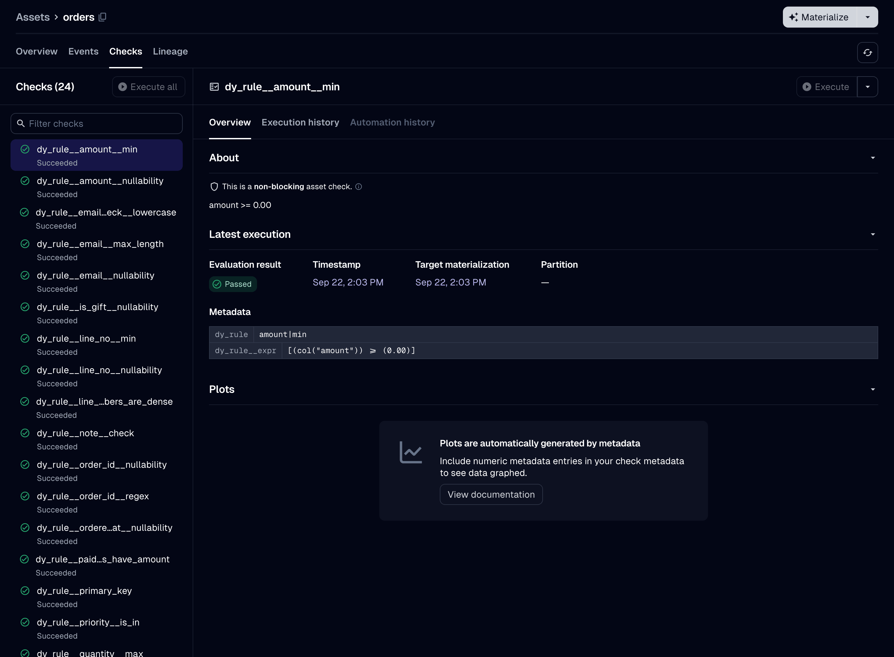

```{python}
#| label: setup-declaring-an-asset
#| code-fold: true
#| code-summary: "Setup: the demo's `Orders` schema, which every example on this page uses"
#| output: false
import dagster as dg
import dataframely as dy
import polars as pl

import dagster_dataframely as dd
from dagster_dataframely_demo.schema import Orders
```

The schema is the only required argument, and it is positional.
Every other argument is `quarantine`, one of the [Settings](settings.qmd), or a `@dg.asset` parameter under the same name.

You write the decorated function as you would for `@dg.asset`:

```{python}
#| label: declaring-an-asset-1
@dd.asset(Orders, quarantine=True, group_name="sales")
def orders(context: dg.AssetExecutionContext, raw_orders: pl.DataFrame) -> pl.DataFrame:
    context.log.info("%d rows arrived", raw_orders.height)
    return raw_orders
```

Dagster passes upstream assets to it by parameter name, as it does for a plain `@dg.asset`.
Use `ins=` and `deps=` where a parameter name is not enough.
Declare a `context` parameter to use the partition key, the log, resources or configuration.

This package does its work at two times: when the module imports, and when the asset runs.

<!-- rumdl-disable-next-line MD078 -->
```{mermaid}
%%| label: declaring-an-asset-diagram
flowchart TB
    subgraph load["when the module imports"]
        D["@dd.asset(Orders)"] --> T["Columns tab"]
        D --> C["a check spec per rule set"]
    end
    subgraph run["when the asset runs"]
        direction TB
        F["decorated function returns a frame"] --> CS["column-schema check"]
        CS --> FL["Schema.filter"]
        FL --> V["valid rows, to the asset's IO manager"]
        FL --> I["invalid rows, to the quarantine"]
        FL --> R["a result per check"]
    end
    load --> run
```

Two things exist as soon as the module imports, before any run:

- **The Columns tab**, built from the schema.
  The tab shows dtypes, descriptions, nullability, uniqueness, the primary key at table level, and every other column constraint beside its column.
- **A check spec per rule set**, so the catalog lists the asset's checks by name before the first run.



The asset's description comes from the schema's docstring, as [Naming](naming.qmd) describes.

A run checks the column schema of the frame the decorated function returns, then filters the frame with `Schema.filter`.
The asset's IO manager writes the valid rows.
A writer writes the invalid rows to the quarantine.
Each check reports a result.
Not every run writes both the valid and the invalid rows: [The failure policy](the-failure-policy.qmd) lists the six outcomes and what each one writes.

`dd.asset` builds a `@dg.asset` and accepts its parameters under the same names, except the six below.
A test fails if `@dg.asset` adds a parameter that `dd.asset` lacks, or removes one that `dd.asset` passes on.
`config_schema` is narrower than Dagster's: it takes only a mapping, not the union of six types that `@dg.asset` accepts.
A type checker rejects the five legacy forms, but nothing rejects them at run time.

| `@dg.asset` parameter | why it is not here | what to write instead |
| --- | --- | --- |
| `check_specs` | they come from the schema's rules | nothing |
| `key` | `key_prefix` and `name` set it | `key_prefix=` plus `name=` |
| `output_required` | the outcomes that write nothing must end the step without an output | nothing |
| `dagster_type` | declined ([#3](https://github.com/ozanozbeker/dagster-dataframely/issues/3)): it runs before the IO manager and cannot set a severity, so it cannot apply the failure policy | the schema, which this package validates against |
| `is_virtual` | a virtual asset has no function to decorate | nothing |
| `io_manager_def` | `resource_defs` already sets it | `resource_defs={"io_manager": ...}` |

## The schema is a single `dy.Schema`, never a `dy.Collection`

Passing a Collection raises `CollectionNotSupportedError` at decoration time.
Declare one asset per member instead, each with the member's own schema.

The parts under [Hand-wiring](hand-wiring.qmd) cannot validate a Collection either, because `validation_results` takes a single schema.

## What the decorated function returns

It can return five things:

```text
pl.DataFrame                dg.MaterializeResult[pl.DataFrame]
pl.LazyFrame                dg.MaterializeResult[pl.LazyFrame]
None
```

**The returned value determines what happens, not the annotation.**
The same `Schema.filter` call filters a `LazyFrame` and a `DataFrame`.
A `dg.MaterializeResult` is unwrapped first.

`@dg.asset` enforces its return annotation, because it infers the output's `dagster_type` from it.
`dd.asset` does not.
The asset always stores a `DataFrame`, because this package collects the valid rows even when the function returns a `LazyFrame`.
Annotate the function anyway, so that a type checker enforces the annotation.
Parameterize a returned result, because a strict type checker rejects a bare `dg.MaterializeResult` as an implicit `Any`.

Return a `dg.MaterializeResult` instead of a bare frame when you want to add metadata, tags or a data version to the materialization.
Prefer it to `context.add_asset_metadata`: it is the only one of the two that works when you call the asset directly.
[Attaching your own metadata](what-a-run-produces.qmd#attaching-your-own-metadata) describes both.

Return `None` to skip, as [A partition with no data](where-invalid-rows-go.qmd#a-partition-with-no-data) describes.
To skip, return `None` itself: `dg.MaterializeResult(value=None)` raises `MaterializeResultValueError`.

Return anything else and the run fails with `dg.DagsterInvariantViolationError` before the column-schema check.
