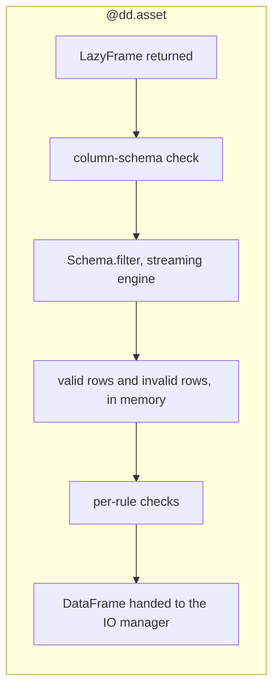

```{python}
#| label: setup-lazyframes
#| code-fold: true
#| code-summary: "Setup: the demo's `Orders` schema, which every example on this page uses"
#| output: false
import dagster as dg
import dataframely as dy
import polars as pl

import dagster_dataframely as dd
from dagster_dataframely_demo.schema import Orders
```

Two places meet a `pl.LazyFrame`, and they read it differently on purpose.
A read has no object yet, so the annotation is the only signal it has.
Validation takes the plan and executes it, once, in `Schema.filter`.



Six steps in a line: the `LazyFrame` is returned, the column-schema check runs, `Schema.filter` executes the plan on the streaming engine, the valid rows and the invalid rows land in memory, the per-rule checks report, and a `DataFrame` goes to the IO manager.

## Reads dispatch on the annotation

Annotate an input `pl.LazyFrame` and the IO manager hands back an unexecuted scan, so a downstream `filter` or `select` prunes rows and columns before anything is decoded:

```{python}
#| label: lazyframes-1
@dd.asset(Orders)
def recent(orders: pl.LazyFrame) -> pl.LazyFrame:
    return orders.filter(pl.col("amount") > 100)
```

The read is the IO manager's, so this is a property of the one you bound rather than of this decorator, and the annotation works the same on a plain `@dg.asset`.
Annotate `pl.DataFrame` instead and the file is read whole.

## Validation materializes

`Schema.filter` takes a plan and hands back two: the valid rows and the invalid rows.
This package collects both, together, in one `collect_all` on the streaming engine, so the source is not read twice.

**A `LazyFrame` return executes there, once, and is validated exactly as a `DataFrame` return is.**

```{python}
#| label: lazyframes-2
@dd.asset(Orders)
def orders(raw_orders: pl.LazyFrame) -> pl.LazyFrame:
    return raw_orders.filter(pl.col("amount") > 0)
```

Your joins, filters and aggregations therefore run in the streaming engine, which the package's `collect_all` names rather than leaves to `auto`.
Polars falls back to the in-memory engine for anything streaming cannot run, so naming it never fails a plan.
An `auto` that chose to collect would keep the plan's own peak.

What comes into memory is what the plan produced, not the plan.
Peak memory is that frame plus one boolean column per rule, held once while the valid rows and the invalid rows are cut from it, rather than the plan's own high-water mark.
That is the saving for a plan with a large intermediate: a join that fans out before filtering back down otherwise pays for the fan-out in memory.
A `DataFrame` return takes the same call after a free `.lazy()`, so there is one path and nothing past `Schema.filter` can tell the two apart.
The column-schema check runs before `Schema.filter`, off `collect_schema()`, so a frame whose columns disagree with the schema is refused before a single row is pulled through the plan.

What stays eager is storage, not the computation.
This package does not promise to write a table.
It promises to write a table and report on it.
Every outcome past `Schema.filter` counts, samples, writes or profiles the valid rows and the invalid rows, and validation cannot choose among its outcomes without counting both.
So the outcomes whose whole purpose is that nothing gets written would have to execute the plan to learn that, and writing straight to storage would have written before it knew.
A plain `@dg.asset` streams end to end with nothing read back, because it has none of those duties: no schema means no validation, no per-rule checks and no statistics pass, so nothing forces the result into memory.
The measurements are in [`docs/research/lazyframe-end-to-end.md`](https://github.com/ozanozbeker/dagster-dataframely/blob/main/docs/research/lazyframe-end-to-end.md).

This is the cost of schema on write, and it is paid at silver and gold scale rather than at ingestion scale.
