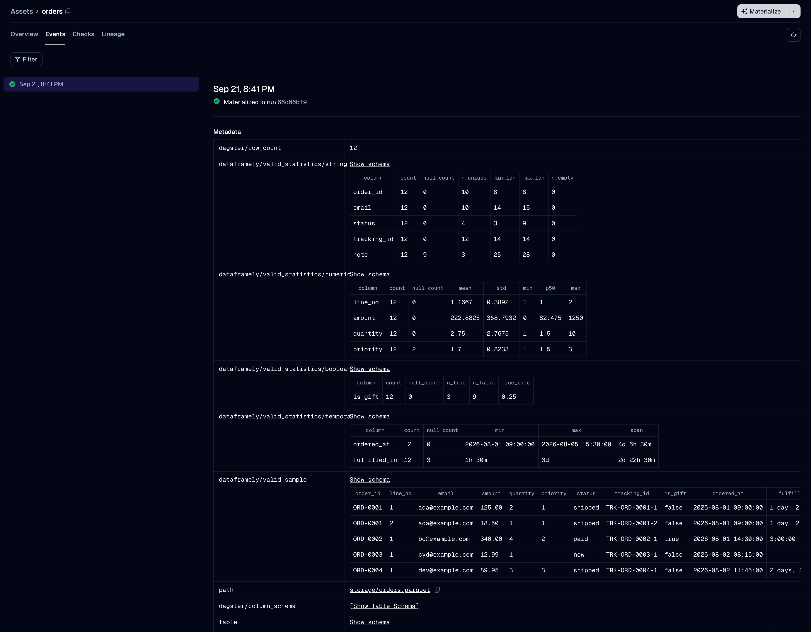

```{python}
#| label: setup-what-a-run-produces
#| code-fold: true
#| code-summary: "Setup: the demo's `Orders` schema, which every example on this page uses"
#| output: false
import dagster as dg
import dataframely as dy
import polars as pl

import dagster_dataframely as dd
from dagster_dataframely_demo.schema import Orders
```

Launching is Dagster's business and works the way it always does: materialize from the UI, from a schedule or a sensor, or call `dg.materialize([orders], resources={...})`.
What the run leaves behind is the part this package is for, and it lands in two places: the table's materialization, and the asset checks.

## The table's materialization

The row count goes under Dagster's own `dagster/row_count`, and everything else this package writes sits under `dataframely/`, so it sorts in one block apart from Dagster's keys and your IO manager's.

| key | what it holds |
| --- | --- |
| `dagster/row_count` | how many rows passed validation, not how many arrived |
| `dataframely/valid_sample` | the first few of those rows |
| `dataframely/valid_statistics/<group>` | one table per dtype group present |
| `dataframely/quarantine_address` | where the invalid rows went, on the runs that wrote any |
| `dataframely/invalid_count` | how many rows failed at least one rule |
| `dataframely/invalid_sample` | the first few of those, rule columns included |
| `dataframely/invalid_by_rules` | which sets of rules the rows broke together, biggest group first |

The last four are absent on a clean run, where there is nothing to say.
`dataframely/invalid_by_rules` is what stops one broken upstream field that trips three rules reading as three unrelated counts.
It spells each rule the way the quarantine's own columns spell it, at every granularity, so the table and the rows it counts line up.
The check list reads the same only at `rule` granularity, since `column` and `schema` name a check after the column or the schema instead.
At either of those, follow a rule to the quarantine rather than to a check.


Every value that holds rows is a Dagster table value rather than markdown, so the UI renders a real table with sorting rather than printed text.
The two counts and the quarantine address are scalars, which is what they are.



## The statistics tables

One table per dtype group present in what was written, each a row per column in the frame's own order.
A column whose dtype belongs to no group reaches no table: a `List`, `Struct` or `Array` has nothing to say past a count and a null count.

| group | dtypes | columns |
| --- | --- | --- |
| `numeric` | `Int*`, `UInt*`, `Float*`, `Decimal` | `count`, `null_count`, `mean`, `std`, `min`, `p50`, `max` |
| `temporal` | `Date`, `Datetime`, `Time`, `Duration` | `count`, `null_count`, `min`, `max`, `span` |
| `string` | `String`, `Categorical`, `Enum`, `Binary` | `count`, `null_count`, `n_unique`, `min_len`, `max_len`, `n_empty` |
| `boolean` | `Boolean` | `count`, `null_count`, `n_true`, `n_false`, `true_rate` |

`mean`, `std`, `p50` and `true_rate` are derived, so they round to four places.
`min` and `max` exist in the data, so they show exactly.
The UI never displays a number nobody stored.

Lengths are bytes throughout, which is also the unit Dataframely's `max_length` bounds a `String` in, so a column constraint and this table agree.
A `span` is rendered in Polars' own duration form, `8d` or `1m 30s`, rather than ISO-8601.

**The string group carries no value-bearing statistic**, at any setting.
A `min` or `max` on an email column would print real addresses permanently into a shared, exported event log.
Lengths and cardinality catch the same defects.
The `statistics` setting does not cover this, because consenting to summary statistics is not consenting to raw values.

The quarantine carries no statistics at all.
What the invalid rows look like in aggregate is a question about a table nobody consumes.

## The checks

The column-schema check reports first and blocks, then one check per rule set.

| check metadata | on which check |
| --- | --- |
| `dy_rule`, `dy_rule__expr` | a check reporting for one rule |
| `dy_failed_count` | a check reporting for one rule, when anything failed |
| `dy_failed_sample` | any check, when anything failed |
| `dy_rules` | a collapsed check: a row per member rule with its failure count and expression |
| `dy_schema__errors` | the column-schema check, when it fails: a row per offending column |

`dy_rule__expr` carries the expression rather than the bound, so tightening a `min` does not rename the check and orphan its history.
A collapsed check's `dy_failed_sample` carries `dy_rule` on each row, so a sample standing for several rules still names the one that put each row there.
There is no total failure count on a collapsed check: counts are per rule and one row can break several, so a sum would state a row count that is not one.

Samples are bounded per rule rather than per check.
A bound shared across a rule set would let the rule a thousand rows failed crowd out the rule one row failed, and the second is the more interesting.

On the outcomes that raise there is no materialization to carry the quarantine address, so `dataframely/quarantine_address` is copied onto every check result instead.
A reader looking at a failed run finds it wherever they look.

The Columns tab is not one of these two places.
It comes off the definition, so it is filled in before the first run and stays filled after a failed one.

## Attaching your own metadata

Use the context to read the run.
Use the return to write the materialization.

**Return a `dg.MaterializeResult` carrying the frame.**
It is what `@dg.asset` accepts, it is the only supported route to a materialization's tags and data version, and it survives direct invocation:

```{python}
#| label: what-a-run-produces-1
@dd.asset(Orders)
def orders(raw_orders: pl.DataFrame) -> dg.MaterializeResult[pl.DataFrame]:
    return dg.MaterializeResult(
        value=raw_orders,
        metadata={"source": "stripe", "extracted_at": "2026-08-13"},
        data_version=dg.DataVersion("2026-08-13"),
        tags={"run/flavour": "backfill"},
    )
```

`value` is the frame to validate, and you have to set it.
`metadata`, `data_version` and `tags` land on the table's materialization, which is the only one there is.
The quarantine materializes no event, so nothing you set here can reach it.

The result's own `asset_key` and `check_results` fields are refused by name with `MaterializeResultFieldError`, because the decorator decides the key from what it was declared with and the check results from the schema's rules.
Naming the culprit beats dropping it silently, which would leave your check result nowhere and say nothing about why.

**This package's own metadata keys win a collision.**
A returned `dagster/row_count` loses to the count this package made, and so does anything under `dataframely/`.
This package generates those keys, so a collision is a mistake rather than an override.
Everything else you attach is yours, and it is carried through untouched.


### The context route

`context.add_asset_metadata` is the other way in, and it is what older Dagster examples reach for.
Nothing here blocks it, and since the decorator builds one asset with one key, the bare call works:

```{python}
#| label: what-a-run-produces-2
@dd.asset(Orders)
def orders(context: dg.AssetExecutionContext, raw_orders: pl.DataFrame) -> pl.DataFrame:
    context.add_asset_metadata({"source": "stripe"})
    return raw_orders
```

Two things about it are worth knowing, and one neighbouring call is worth avoiding.

**It overrides this package's own keys, where a returned result loses to them.**
Dagster builds an event's metadata from the output's first and applies the context's accumulator last.
So `context.add_asset_metadata({"dagster/row_count": 999})` puts 999 in the catalog for a table with two rows.
Nothing here can defend against that, because the merge happens after this package has yielded.

**`context.set_data_version` is not supported.**
It is mentioned here so you know why it is missing rather than going looking for it: it carries no `@public`, and you cannot reach it by calling the asset.
Return `data_version=` on a `dg.MaterializeResult` instead, which produces the same event tags.

One more call looks right and is not: `context.add_output_metadata`.
Every asset check is an output, and this package always declares at least the column-schema check, so an asset here always has several:

```text
DagsterInvariantViolationError: Attempted to add metadata without providing output_name, but multiple outputs exist. Please provide an output_name to the invocation of `context.add_output_metadata`.
```

Naming the output does work, and the name is `result` whatever the asset is called: a single-output asset has one, and Dagster names it the same way under every `key_prefix`.
That is a Dagster internal spelling rather than anything this package chose, so hardcoding it ties your asset body to a name the catalog never shows you.
Reach for `add_asset_metadata` instead.

::: {.callout-note}
`add_asset_metadata`, `set_data_version` and `add_output_metadata` are the whole of what this package has checked against Dagster's context, and no more will be checked.
Nothing is guaranteed about the rest of the context, now or in a future Dagster.
If you find another method that works and is worth teaching, [open an issue](https://github.com/ozanozbeker/dagster-dataframely/issues).
:::
