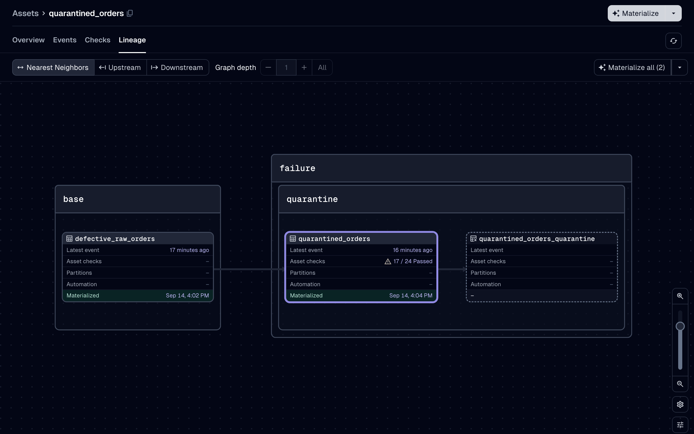

```{python}
#| label: setup-where-invalid-rows-go
#| code-fold: true
#| code-summary: "Setup: what every example on this page assumes"
#| output: false
from pathlib import Path

import dagster as dg
import dataframely as dy
import polars as pl

import dagster_dataframely as dd


class Orders(dy.Schema):
    """Customer orders, one row per order line."""

    order_id = dy.String(primary_key=True)
    amount = dy.Float64(nullable=False, min=0.0)


from dagster_polars import PolarsParquetIOManager


@dg.asset
def raw_orders() -> pl.DataFrame:
    return pl.DataFrame({"order_id": ["a", "b"], "amount": [1.0, 2.0]})


# The monthly-by-distributor grid the skip example below is written against.
class SupplierReport(dy.Schema):
    supplier_id = dy.String(primary_key=True)
    reported_on = dy.Date(nullable=False)


grid = dg.MultiPartitionsDefinition({
    "month": dg.MonthlyPartitionsDefinition(start_date="2026-01-01"),
    "distributor": dg.StaticPartitionsDefinition(["acme", "globex"]),
})


def source_path(key: dg.MultiPartitionKey) -> Path:
    cell = key.keys_by_dimension
    return Path(f"raw/supplier_reports/{cell['distributor']}/{cell['month']}.parquet")
```

`quarantine=True` is the whole setup.
There is no directory to configure and no second asset to declare.

**The invalid rows are written through the IO manager the asset is already bound to**, under the asset's own key with `_quarantine` on the end.
`analytics/orders` puts them at `analytics/orders_quarantine`.
Nothing in this package learns which manager that is: every asset-key-addressed IO manager already turns a key into its own address, so one suffix places the quarantine natively on every backend (ADR-0006).

That means one declaration and two outcomes, rather than two integrations:

```{python}
#| label: where-invalid-rows-go-1
@dd.asset(Orders, quarantine=True)
def orders(raw_orders: pl.DataFrame) -> pl.DataFrame:
    return raw_orders.select("order_id", "amount")
```

| what you bound | where the invalid rows land |
| --- | --- |
| `PolarsParquetIOManager` | `orders_quarantine.parquet`, beside `orders.parquet` |
| `DuckDBPolarsIOManager` | the table `orders_quarantine`, beside `orders` in the same schema |

The first is a `UPathIOManager` and the second is a `DbIOManager`, which are the two base classes Dagster ships.
Between them they cover nearly every first-party manager.

The rows carry their original columns, then one `String` rule column per rule reading `valid`, `invalid` or `unknown`, named for the rule rather than for the check reporting it.
At the default `rule` granularity those are the same string; at `column` or `schema` the checks are named after the column or the schema, so follow a rule to a quarantine column rather than to a check.
Check metadata samples are bounded, so without these columns the per-row attribution exists nowhere at volume.

The valid table's materialization carries the quarantine address the rows went to, how many there were, and which sets of rules they broke together.
See [What a run produces](what-a-run-produces.qmd).

**A partitioned asset on a database manager needs `partition_expr`.** `DbIOManager` raises without it, and you already declare it for your own partitioned table.
It reaches the quarantine automatically, on the definition metadata the write carries.

**`quarantine=True` adds a `context` parameter to the asset**, whether or not your function declared one.
The writer is built from the execution context, and a wrapper cannot ask Dagster for a parameter it did not declare.
Calling such an asset therefore takes a `dg.build_asset_context()` first.
See [Testing an asset](testing-an-asset.qmd).
An asset without a quarantine keeps exactly the signature you wrote.

## The quarantine is not an asset

It is evidence of a run.
It holds no place in the graph, receives no materialization event, and nothing downstream can depend on it until you say so.

`quarantine_spec` is how you say so:

```{python}
#| label: where-invalid-rows-go-2
defs = dg.Definitions(
    assets=[raw_orders, orders, dd.quarantine_spec(Orders, orders)],
    resources={"io_manager": PolarsParquetIOManager(base_dir="data/warehouse")},
)
```



That returns a `dg.AssetSpec` keyed `orders_quarantine`, depending on `orders`, with its own Columns tab.
It has no compute, because the decorator already wrote the rows.
The spec's key resolves through the same IO manager the write used, so a downstream asset can name it as an input and read it back with no routing at all.

**The quarantine's Columns tab carries no column constraints.**
The schema's columns are mirrored with their dtypes, descriptions and tags, then one `String` column per rule.
Every constraint the valid table states is one these rows break, so a `not null` on a column full of nulls would state something false about every row.
The primary key is stated at table level on the valid table and nowhere here, because a duplicate key is exactly what ends up in the quarantine.

The schema is passed explicitly because nothing on an `AssetsDefinition` carries the live class.
Pass the asset itself and its partitions come along; pass a key form and use `partitions_def=` instead.
Passing both raises `dg.DagsterInvariantViolationError`.

**It never receives a materialization event.**
Nothing materializes it, and saying otherwise would be a lie the catalog then repeats.
That is the fact to design around if you want to automate on invalid rows.
See [Automation](partitioning.qmd#automation).

## `quarantine_dir` is for calling, not running

A call has no step, so there is no IO manager to write through.
`DAGSTER_DATAFRAMELY_QUARANTINE_DIR` is the directory the rows go to on that path, and it is read on that path only.

```bash
DAGSTER_DATAFRAMELY_QUARANTINE_DIR=/tmp/quarantine
```

It is read where the rows are handed over, so a `monkeypatch.setenv` in a test counts even though the module holding the asset imported long before.
A call whose every row is valid never reads it at all.

Unset, a call with rows to hold back raises `QuarantineDirError` rather than choosing a directory on your behalf.
The rows are evidence, and writing them somewhere nobody named is how evidence gets lost.

There is deliberately no per-asset override.
A directory is meaningless to a warehouse, so the three cases an override would serve are recorded in ADR-0006 and deferred until somebody needs one.

Under that directory the layout mirrors `UPathIOManager`, with the key and partition naming the rest of the file path:

```text
<quarantine_dir>/<key part>/.../<name>_quarantine.parquet
<quarantine_dir>/<key part>/.../<name>_quarantine/<partition>.parquet
```

A partition is a file under a directory rather than a longer file name, so a backfill of one partition rewrites one file.
Parquet only: the quarantine holds whatever dtypes the schema declares, and a format that cannot round-trip them would make the evidence disagree with the table it came from.

A multi-partition key is formatted as its dimension keys joined by `/`, ordered by dimension name.
A partition key that would climb out of the directory is escaped rather than refused, so no partition can name a file outside `quarantine_dir`.

## A partition with no data

Some partitions have no source data, and never will.
A monthly by distributor grid where one distributor left the marketplace two years ago is the shape: its historical partitions hold real data and must stay, its recent ones have no file.

That is not a failure, and it is not an empty table either.
Return `None` and the asset skips: nothing is validated, nothing materializes, and the run succeeds, so the partition stays unmaterialized instead of materializing zero rows or failing with an error.

```{python}
#| label: where-invalid-rows-go-3
@dd.asset(SupplierReport, partitions_def=grid)
def supplier_reports(context: dg.AssetExecutionContext) -> pl.DataFrame | None:
    path = source_path(context.partition_key)
    if not path.exists():
        return None
    return pl.read_parquet(path)
```

**The existence test is yours to write.**
The decorator never catches `FileNotFoundError`, or anything else, to decide this for you.
It cannot tell a file that is legitimately absent from a path that is misconfigured, and guessing wrong would turn a broken pipeline into a silently missing partition.
`None` is how you say the first; letting the error escape is still how you say the second.

The trade is taken knowingly.
A forgotten `return` is the same object as a deliberate skip, so it now costs a run that materializes nothing, and the missing partition is what makes that visible.

**Every check still reports on a skipped run, and passes.**
That is not politeness.
A check spec is a non-optional output whatever the asset declares, so a step that answers none of them fails outright, and `@dg.asset(output_required=False)` hits the same wall the moment it declares one check.
So the rules are run over `Schema.create_empty()` and report what that says.
Nothing is fabricated: every rule was evaluated, over zero rows, and none was violated.
Dagster records those evaluations with no `target_materialization_data`, so a passing check on a skipped partition does not claim to have checked the last one that had data.
